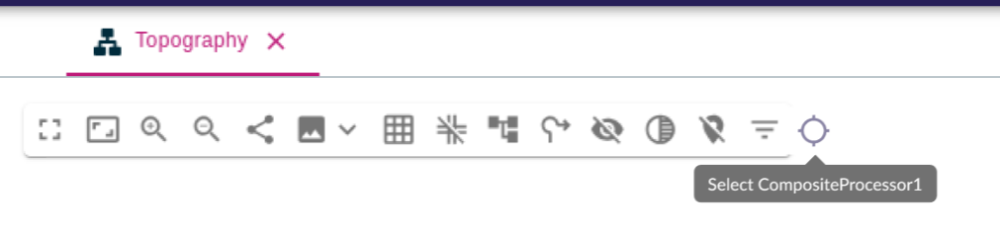
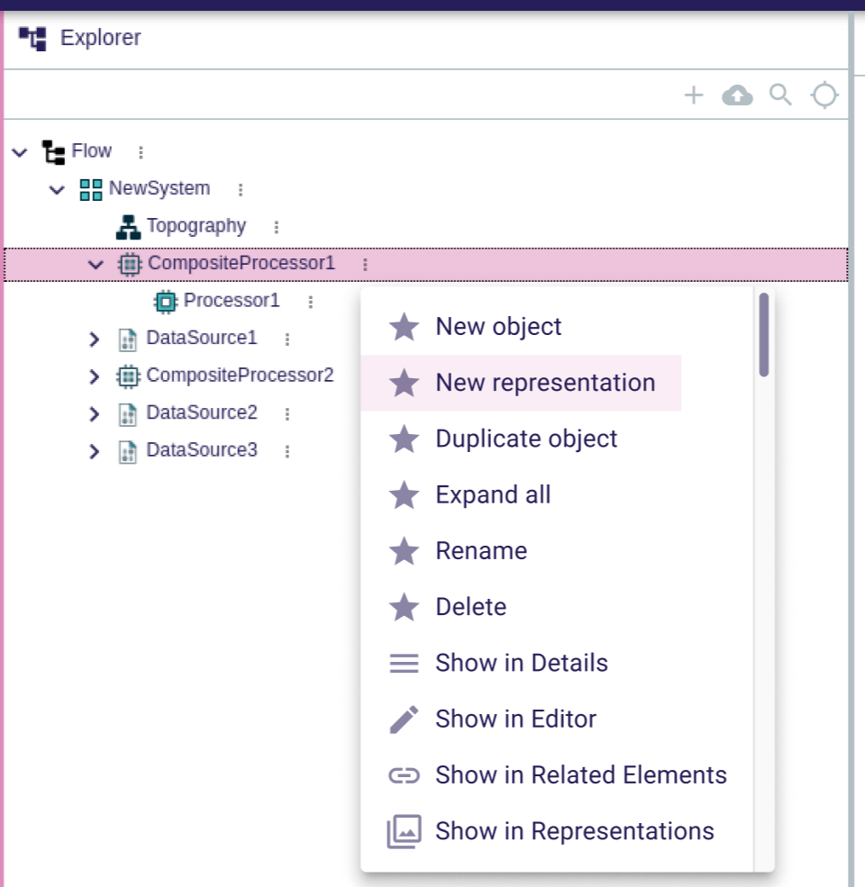
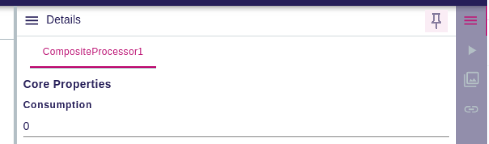

= (M) Rework the management of the selection in the workbench and in various representations

== Problem

The current situation is too complex technically, too restrictive for the end users and a significant source of performance issues.

It does not allow the end user to manipulate multiple objects at the same time to view on object in the explorer while interacting with another in a diagram for example (the explorer would move to display the element selected in the diagram constantly) or the other way around (this time the diagram would move because it considers that the end user should obviously see what is being clicked in the explorer).

It is now the source of multiple bugs related to the selection, especially when a diagram is opened.

It creates major headaches to write Cypress tests since everything moves anytime the selection is updated (which is pretty much anytime anything is done)

== Key Result

* End-users have a better understanding and better control on how selection "flows" between the different parts of the UI.
* Selection inside the different parts of the UI will be better isolated with less side-effects between them, which should prevent some bugs and allow for better testability.

== Solution

The workbench will continue to have a global selection (no change there).

Representations, in particular the _Explorer_ view and diagrams, will also have their own _local selection_.

When the user interacts with a representation (e.g. selects an item in the explorer or a node on a diagram), it will update the local selection for this representation and also the workbench selection.

However, representations will no longer automatically update their local selection when the workbench selection changes (no automatic "pull").
Instead, they will get a new button that the end-user can hit to update the representation's local selection to match the global one.
This action is an explicit, one-shot operation, _not_ a toggle so enable/disable automatic synchronization (indeed, in the Explorer, the new button wll _replace_ the existing toggle).

This behavior will apply to the left-side views (in practice, only the _Explorer_ is concerned) and the "full" representations that can be opened in the main area.
For full representations, we will start with only diagrams for now, but Tree, Gantt, Deck and Table will need to be updated too.
Form representations are not concerned.

The views displayed on the right side of the workbench (e.g. the _Details_ view) will have a different behavior, because their are designed to show information about the currently selected element(s).
Their default behavior will not change, i.e. they will continue to "follow the global selection".

However they will get a new toggle button that the user can enable to "pin" the view on the current selection and stop following global selection changes.
When the "pin" mode is disabled, the view restarts immediatbly synchronizing with the global selection.

These changes will provide better control for the end-user about when a view or representations "pulls in" the global selection.

We will also provide new operations to allow the user to "push" the local selection from a view or representation directly into another other.
This will appear as context menu operations named "Show in XXX" for each of the registered selection targets (e.g. the opened representation, the details view, etc.).

=== Breadboarding

The new button in the diagram's palette to synch with the current global selection:

The Explorer showing the equivalent button and additional context menu actions to "push" its own selection to other parts of the UI:

The Details view with the "Pin selection" toggle button:

=== Cutting backs

* Updating Tree, Gantt, Deck and Table representations.

== Rabbit holes

* We know the current selection-related code in diagrams is complex and fragile.
* Implementing the new "Show in XXX" actions will require new frontend mechanisms to allow different parts of the UI which are normally isolated to communicate.

== No-gos

