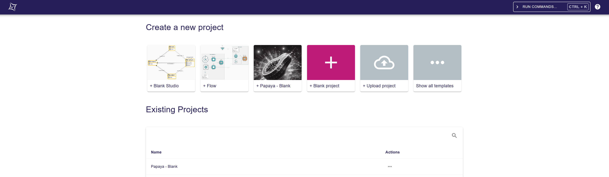

= Add command palette on projects page

== Problem

The `projects` page doesn't provide a command palette.
This command palette could be useful to let users search projects, or create projects from templates.

== Key Result

- A button (similar to the one in the project workbench) should be available on the navigation bar of the `projects` page
- Clicking on the button (or pressing `CTRL + K`) should open the command palette
- The command palette should display projects-related commands
- The command palette should allow user to search commands

=== Acceptance Criteria

- A palette containing commands to create a project from the available templates should be provided.
- A Cypress test should leverage the new functionality and validate the whole user experience.
- Backend integration tests should also be available to ensure that the core parts of the behavior are working as expected.

== Solution

=== Scenario

=== Create a project from template via the command palette

- The user clicks on the command palette button to open it
- The command palette contains commands to create projects from templates
- The user clicks on a project creation command
- The project is created and the user is redirected to the project
- The project is correctly initialized with the template's content

=== Breadboarding

=== Cutting backs

== Rabbit holes

== No-gos

