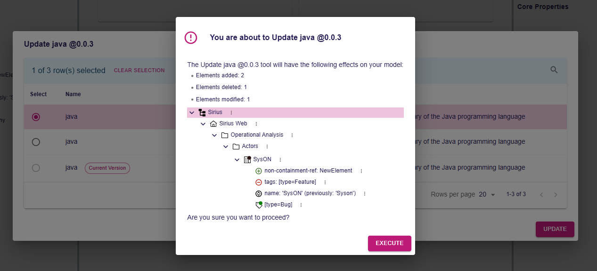

= Add support for tree presentation of impact analysis reports

== Problem

The impact analysis dialog displays superficial information regarding the impact of an action (number of created/deleted/modified elements).
The user cannot inspect the changes to precisely see which elements have been modified, and how. 

== Key Result

- The impact analysis dialog displays a tree containing the elements impacted by the action
- Specific icons and overlays are visible in the tree to quickly identify what has changed and how
- The tree does not contain branches of the model that do not contain impacted elements
- The impact analysis dialog still displays the high-level information, as well as the additional messages that are parts of the report

=== Acceptance Criteria

- A Cypress test should leverage the new functionality and validate the whole user experience.
- Backend integration tests should also be available to ensure that the core parts of the behavior are working as expected.

These tests should ensure that the following information is correctly presented to the end user:
- Addition/deletion of a containment reference
- Addition/deletion of a non-containment reference (i.e. not visible in the default explorer)
- Update of an attribute's value

== Solution

Sirius Web will provide an impact analysis tree presenting the semantic data enriched with the changes computed from the impact analysis.
Specifically, it will provide icon overlays to mark elements as new/deleted/modified, and virtual elements (with their dedicated icons) to represent changes that cannot be displayed in the usual containment structure of a tree (like attribute values or non-containment references).

An element marked as modified has changes in its own feature (we do not mark the entire containment structure as modified, just the elements that are actually modified).

The tree will be read-only, and branches of the model that do not contain any change won't be displayed.

=== Breadboarding

The example above represents the following changes on the SysON object:

- An object "NewElement" has been added to the "non-containment-ref" reference
- The tag "[type=Feature]" has been removed from the "tags" containment reference  
- The name of the object has been changed from "Syson" to "SysON"
- A new tag "[type=Bug]" has been added as a child of SysON

=== Cutting backs

== Rabbit holes

The lifecycle of this feature could be an issue: we have to find a way to pass the list of semantic changes computed by the impact analysis to the tree.

== No-gos

