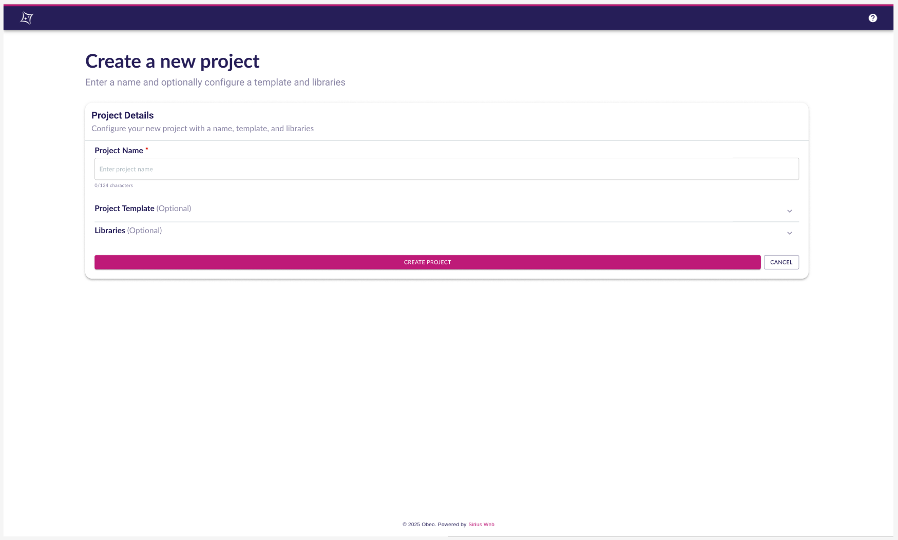
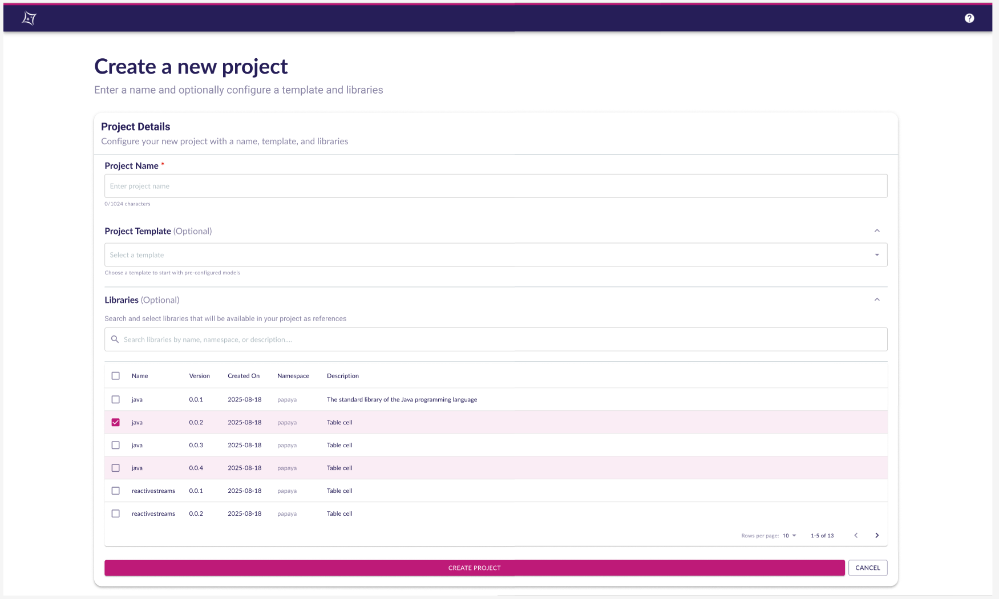

= Improve the creation of new project

== Problem

We have at least two mechanism to create a project, the one that create a blank project that ask for a project name, another one that create a project from a template in one click.
We first thought that creating a project in one click was appealing.
As time passes, we observed that the first things users did was to rename the project and try to update everything related to the project name.

We also need to, sometimes, select libraries to import in the project when created.

== Key Result

- Project creation, no matter if it is from a template or not should go to `/new/project`
- The form to create a project should display a widget to give the project name, a widget to select the template used for the creation, the table showing available libraries.
- The widget asking for the project name should be initialized with the name of the project template or `Blank Project` otherwise and the value should be selected.
- The widget to select a project template is initialized using the URL.
That means when the user click on a project template, the URL will have the form `/new/project?templateId=id_of_template`.
- The value of the widget to select a project template can be changed after.
- The table showing available libraries can be shown or hidden thanks to an accordion.

=== Acceptance Criteria

Many Cypress tests should be updated and/or added to validate the behavior of the form to create a project.

== Solution

=== Scenario

==== Go manually to `/new/project`

* The user goes manually to `/new/project`
* The name is prefilled with "Blank Project", the Textfield value is selected
* No project template is selected
* Libraries are not displayed by default
* The user clicks on `Create`
* The user is redirected to the new project, the project is empty

==== Create a project from a template

* The user uses a project template card
* The name is prefilled with the name of the project template, the Textfield value is selected
* The URL contains a query parameter: `templateId=id_of_template`
* The select widget has the corresponding project template selected
* Libraries are not displayed by default
* The user clicks on `Create`
* The user is redirected to the new project, contains everything the project template initializes

==== Create a blank project and select some libraries

* The user uses the Blank Project card
* The name is prefilled with "Blank Project", the Textfield value is selected
* No project template is selected
* The user expands the libraries
* The user selects some of the available libraries
* The user clicks on `Create`
* The user is redirected to the new project, the project contains the imported libraries

=== Breadboarding

==== New view to create a project - default

==== New view to create a project - details

=== Cutting backs

We could leverage the backend validation for project name to ensure the project name uniqueness.
In a near future this will make possible to display the project name directly in the URL instead of the project identifier which has no meaning for the user.

== Rabbit holes

== No-gos