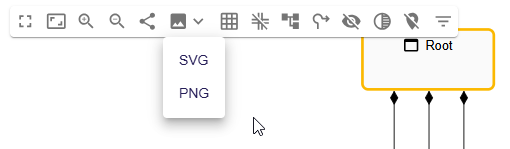

= (S) Improve the image export

== Problem

Sirius Web is able to export image in the SVG format but, most of its content uses `<ForeignObject/>` to put HTML directly inside.
Using `<ForeignObject/>` in the SVG prevent the SVG from being displayed outside a web browser.

== Key Result

An image exported from a Sirius Web diagram can import in a document that can read image like Word or Libre Office.

== Solution

There are more than one solution to resolve that issue, we could find an existing solution, export the image in another format than SVG or implement a custom solution to keep the SVG format.

=== Existing Solution

We were not able to find any existing solutions that can fit our need:

* We tried using https://github.com/vercel/satori:"vercel/satori" but it cannot work because it expects pure and stateless JSX, that our `<DiagramRender/>` is not.
* We also tried https://www.npmjs.com/package/dom-to-svg:"dom-to-svg", which is also not working because, it relies on containment to compute children position and Reactflow put all nodes at the same depth in the DOM.

=== Export in another format

We are currently exporting a diagram in SVG using https://www.npmjs.com/package/html-to-image:"html-to-image".
We could choose to export a diagram in another form using the same library.
We tried to export the image in PNG, and we were rapidly able to export a quite big diagram with a good resolution.

While it will be fast to implements with most of the use cases fulfilled, it comes with some drawbacks:

- It uses the `canvas` object from the browser, and thus, the export is size limited (https://jhildenbiddle.github.io/canvas-size/#/?id=test-results).
- Because the canvas size is limited, the more the diagram takes place, the less the quality will be.
- When we are looking for too much image quality, it is flaky on Chrome and does not work with Firefox.
- we need to find the balanced option between good export quality and working well on Chrome and Firefox.

=== Custom Solution

Implementing a custom solution to be able to open an image exported in SVG from a Sirius Web diagram without a web browser will be a way more costly than the solution above.

== Decision

Sirius Web keeps the current SVG export for the moment.

Sirius Web will export in another format and will provide a PNG export thanks to a dropdown menu at the same place the SVG Export is.

=== Breadboarding

=== Cutting backs

== Rabbit holes

== No-go

- Rework the SVG export
