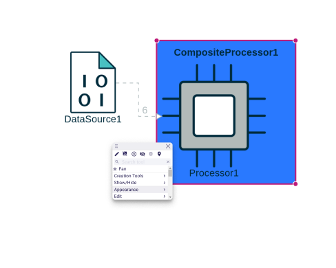
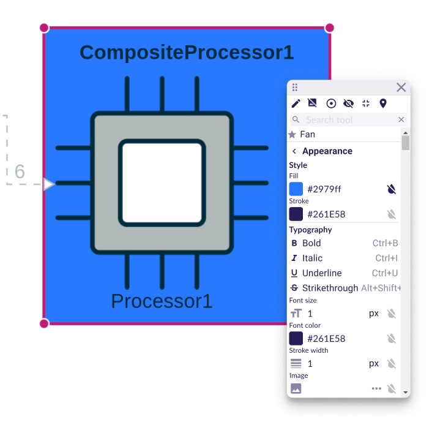
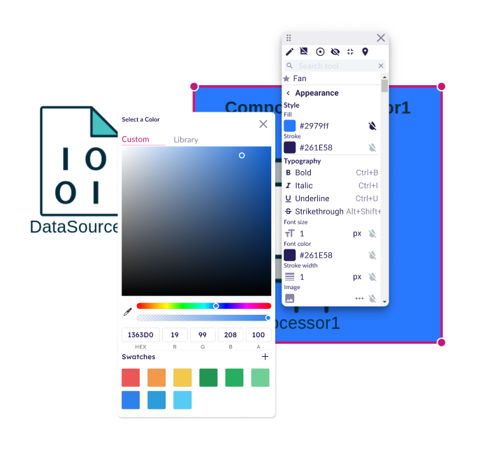
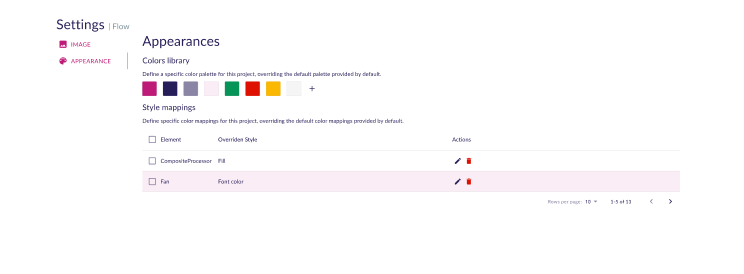
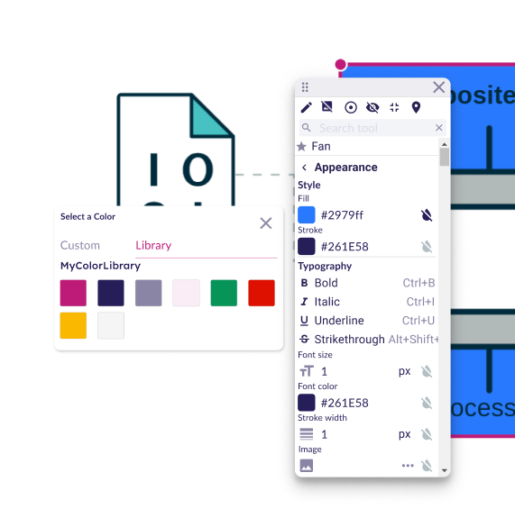

= Add support to manage the appearance of nodes in the palette

== Problem

The specifier offers a wide range of styles for the appearance of nodes and edges in a diagram.
However, when an end-user creates a diagram, they are limited to the styles defined by the specifier.

== Key Result

An end-user must be able to change the style of elements in a diagram.

== Solution

The end-user will have access to a new section in the palette.

Once the new `appearance` section opened, all the node style options will be available.

NOTE: it won't use a form representation, but instead hardcoded React components build with MUI.

To change a color, user would have access to color picker or to chose between a color library (see Cutting Backs)

== Cutting Backs

In the first version, focus only on nodes and only on a very basic subset of this feature.

We will start by adding a new appearance section in the palette to change the bold property of the label.
It will allow us to start with the most basic detail to customize and validate the entire lifecycle of the feature.
It will also require us to figure out the mechanism used to store these end user changes for example.
When this will be done and this first contribution will be integrated, we will thus gain the ability to switch the label of a not between bold and not bold and only this.

In a second contribution, we will add the other basic typography options (italic, underline, strikethrough) to validate that the mechanism is generic enough.
Then in a third contribution, we will work on another kind of property like font size to test numbers.

A fourth contribution will start bringing support for the manipulation of colors with the color picker.
In a fifth contribution, we will start working with some hardcoded library of colors.
Then we will later add the ability to define project specific color libraries.
We will interact with those thanks to the project settings page.

These colors will be available for quick access in the palette.

The same principle will then be applied to edges later.
Other contributions will come after that to bring support for shortcuts for example.

== Rabbit Holes

* It must be easy for a downstream application to contribute new entries to this style palette.
* Style changes should only apply to the selected element and not by default to the type of the selected element.
In a second phase, it should be possible to directly change the style of all elements of a given type.
* Style changes must be persistent.

== No-Gos
