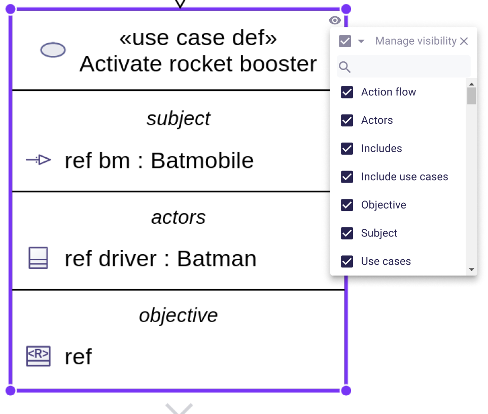
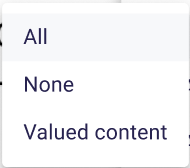

= Add visibility tool on diagram nodes

== Problem

The Show/Hide menu of the diagram nodes context menu (a.k.a the palette) is difficult to understand for the end-users.
Furthermore, it forces users to click 3 times to hide a graphical node:
- right click on the diagram node to open the palette
- left click on the Show/Hide section
- click on Hide menu item

== Key Result

A new UI should be available in Sirius Web, allowing to easily manage the visibility of diagram nodes.
This UI would be an icon and would be placed on the top right corner of the node.
A left click on this icon would have several possibilities:
- click on a container node:
 - a new menu opens on the right of the icon
 - this menu allow to select each child node to hide
 - select a child node in the menu hides it instantaneously
 - select a child node in the menu reveals it instantaneously
 - the menu contains a search bar, allowing to easily filter and find the desired node(s)
 - a checkbox also allows to select/unselect all children nodes at once
 - this checkbox also has a third option: only select children nodes having children nodes (a.k.a valued content)
- click on a leaf node:
 - the node is hidden instantaneously

The existing menu Show/Hide in the Palette will still be there and won't be modified.

=== Acceptance criteria

- Cypress test should be added for all cases

== Scenario

=== click on the new icon of a container node containing "compartments"

- a new menu opens on the right of the icon

=== click on the new icon of a container node containing "lists (a.k.a. icon-label nodes styles)" (a.k.a. compartment node)

- the node is hidden instantaneously

=== click on the new icon of a container node containing "free form nodes"

- the node is hidden instantaneously

=== click on the new icon of a list node (a.k.a. icon-label node style)

- the node is hidden instantaneously

=== click on the new icon of a leaf node

- the node is hidden instantaneously

== Breadboarding

An example of the new menu on a container node:

The UI of the checkbox allowing to select all nodes/unselect all nodes/select children nodes having children nodes at once:

== Cutting Backs

The name of the new menu could be customizable by the specifier.

== Rabbit Holes

- What about nodes with right alignment labels? The new manage visibility icon could be overlapped by the label.
- What about images nodes? Where to put the new manage visibility icon?

== No-Gos
