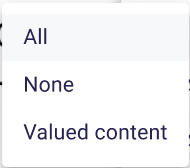

= Add visibility tool on diagram nodes

== Problem

The Show/Hide menu of the diagram nodes context menu (a.k.a the palette) is difficult to understand for the end-users.
Furthermore, it forces users to click 3 times to hide a graphical node:
- right click on the diagram node to open the palette
- left click on the Show/Hide section
- click on Hide menu item

== Key Result

A new UI should be available in Sirius Web, allowing to easily manage the visibility of diagram nodes.
This UI would be an icon and would be placed on the top right corner of the node.
This UI would only be visible on hover.
The specifier will tell which node descriptions will have this UI.

The UI (e.g. an icon) could execute some backend code or display a new frontend component.

For the backend part, Sirius Web could provide an example where the click on the new UI will hide the node.
For the frontend component, Sirius Web could provide an example where the click on the new UI will display a menu allowing to manage the visibility of child nodes.

The existing menu Show/Hide in the Palette will still be there and won't be modified.

=== Acceptance criteria

- Cypress test should be added for all cases

== Scenario

=== click on a node action

It does something directly like hiding a node or it does something on the frontend like opening a dialog.
The specifier will have to tell which one to use and where.

== Breadboarding

An example of the new menu on a container node:

The UI of the checkbox allowing to select all nodes/unselect all nodes/select child nodes having child nodes at once:

== Cutting Backs

The name of the new menu could be customizable by the specifier.
The UI of the checkbox allowing to select all nodes/unselect all nodes/select child nodes having child nodes at once.

== Rabbit Holes

- What about nodes with right alignment labels? The new manage visibility icon could be overlapped by the label.
- What about images nodes? Where to put the new manage visibility icon?

== No-Gos
