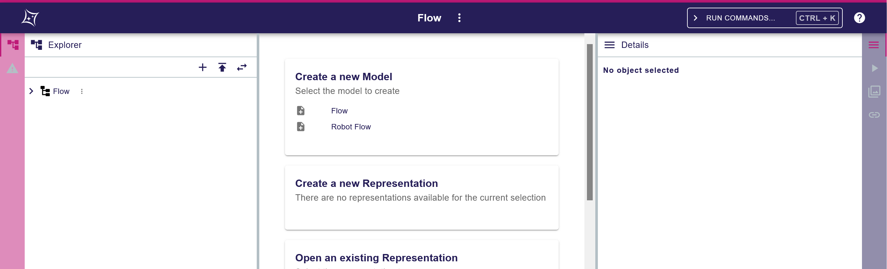
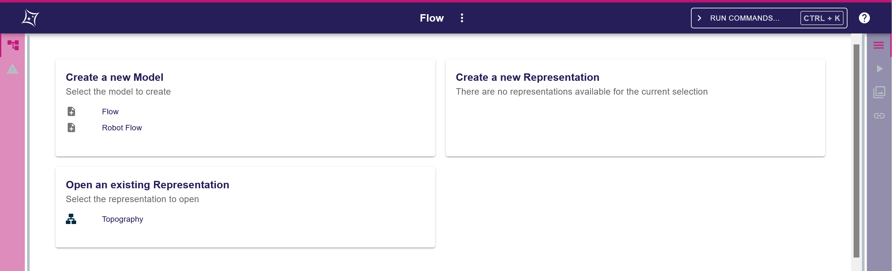
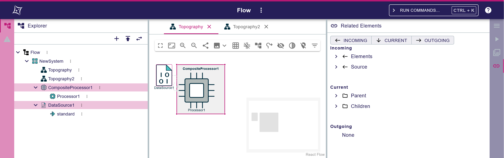
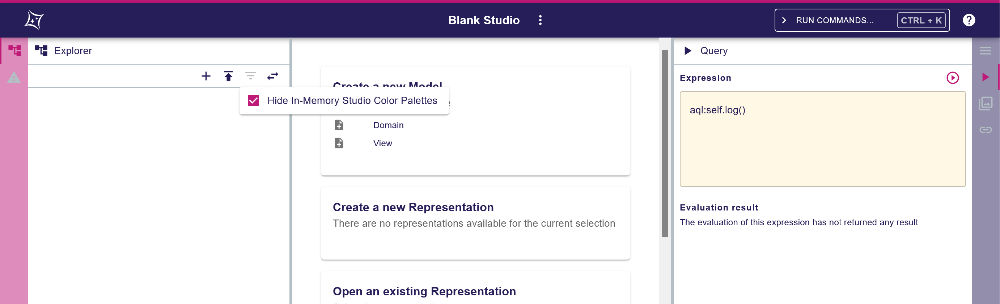

= (M) Encode the workbench state in the URL

Issue: https://github.com/eclipse-sirius/sirius-web/issues/4886[#4886]

== Problem

When opening a project, the URL always starts with: `/projects/:projectId/edit/`.

If at least 1 representation editor is opened, then the URL starts with: `/projects/:projectId/edit/:representationId` where `representationId` is the ID of the representation opened in the active editor.

And since https://github.com/eclipse-sirius/sirius-web/issues/4376[#4376], the URL also contains the current selection of the workbench, meaning the URL can be of the form `/projects/:projectId/edit/?selection=id1%2Cid2` or `/projects/:projectId/edit/:representationId?selection=id1%2Cid2` (where `%2C` encodes `,`).

Reversely, when resolving one of the above-mentioned URLs, the corresponding project, representation and selections are set.

This means that currently, the workbench state that is shareable through a URL is limited to: at most 1 representation, and the selection.

It would be interesting to be able to share other parts of the workbench, such as:
* The left panel (in the Sirius Web application, both `Explorer` and `Validation` are available, the former being the default one).
* The right panel (in the Sirius Web application, `Details`, `Query`, `Representations` and `Related Elements` are available, with the first being the default one).
* The center area (in the Sirius Web application, only the active open representation may is encoded in the URL, otherwise the absence means the project page is displayed).

The different workbench parts available in left, right and center areas may vary depending on the application.
In fact even the notions of left, right and center areas may not be relevant to the actual application.

Moreover, many of these parts have a configurable state (e.g. in view `Explorer`, filters may be applied, in a Diagram the position or zoom level may be changed, etc.), which may have a very impactful semantic meaning (e.g. in SysON the tree explorer representations rely heavily on filters to make the SysML model manageable).

Being able to share the complete workbench state through the application URL would facilitate collaboration between users.

== Key Result

The URL should be synchronized with the full state of the workbench parts.

This means that:
* Our frontend components must make explicit their state/configuration that may be exposed, the associated default values, and offer APIs to conform to a configuration provided by the user through the URL.
* The Sirius Web application must be able to retrieve the workbench state from its components, encode it into the URL, and reversely, be able to decode such a state from the URL in order to apply it to its constituting components.

=== Acceptance Criteria

* The URL is synchronized with the full state of the workbench, which includes:
** All parts of the application willing to expose their state
** In the Sirius Web application this would be:
*** the left and right panels, and their constituting components like the `Explorer`, `Validation`, `Details`, `Query`, `Representations`, `Related Elements` views
*** the center area (representation editors for diagrams, forms, etc.)
** The selection (as already implemented)
* When resolving a URL that specifies a workbench state, the corresponding workbench state is set up.

== Solution

* We will rework the URL to change based on the state of the workbench.
* The base URL for an open project will be `/projects/:projectId/edit`.
* The state of the workbench will be encoded as a JSON object with the following recursive structure:

[source, json]
----
interface WorkbenchState {
  parts: WorkbenchPart[],
  configuration?: object,
  focus?: string;
}

interface WorkbenchPart {
  id: string,
  parts: WorkbenchParts[],
  configuration?: object;
}
----

where:
** `WorkbenchState.focus: string`: the ID of the `WorkbenchPart` that has the user focus.
** `WorkbenchPart.id: string`: the ID of the `WorkbenchPart` (e.g. `left`, `right`, `center`, `explorer`, `details`, etc.).
** `WorkbenchPart.configuration: object`: the part-specific configuration encoded as an arbitrary JSON object.
* The workbench state is encoded in and decoded from the URL through query parameter `workbench`, e.g. `/projects/projectId/edit?workbench=<encoded JSON object>`.
* The URL will still encode the selection through query parameter `selection`, just like it already does, e.g. `/projects/projectId/edit?workbench=<encoded JSON object>&?selection=id1%2Cid2`.

=== Examples

==== Example 1

In this example:
* In the left panel, the Sirius Web application provides 2 views `Explorer` and `Validation`. By default, the application activates `Explorer` and sets it as opened.
* In the center panel, there is no representation or editor opened. By default, the application displays a default page.
* In the right panel, the Sirius Web application provides 4 views `Details`, `Query`, `Representations` and `Related Elements`. By default, the application activates `Details` and sets it as opened.

Since the workbench state is in the default state, the corresponding JSON object could technically be `null`.

At runtime, the Sirius Web application collects the default configurations from its constituting parts.
In turn, each part recursively collects the default configurations from its constituting parts.

Ultimately the default workbench state is the following JSON object:

[source, json]
----
{
  "parts": [
    {
      "id": "left",
      "parts": [
        {
          "id": "explorer",
          "configuration": { ... }
        },
        {
          "id": "validation",
          "configuration": { ... }
        }
      ],
      "configuration": {
        "partId": "explorer",
        "closed": false
      }
    },
    {
      "id": "center",
      "parts": []
    },
    {
      "id": "right",
      "parts": [
        {
          "id": "details",
          "configuration": { ... }
        },
        {
          "id": "query",
          "configuration": { ... }
        },
        {
          "id": "representations",
          "configuration": { ... }
        },
        {
          "id": "related_elements",
          "configuration": { ... }
        }
      ],
      "configuration": {
        "partId": "details",
        "closed": false
      }
    }
  ],
  "focus": "center"
}
----

Notes:
* Since each `WorkbenchPart` has its own configuration, the default configurations for the various views are omitted for now. In the implementation, we will have to make explicit, for each view that wants to be able to contribute to the URL (`Explorer`, `Validation`, `Details`, `Query`, `Representations`, `Related Elements` and all representation editors) the default configuration to use.
* In the Sirius Web application, the "left" and "right" panels are essentially similar, so their configurations follow the same structure:

[source, json]
----
interface SiriusWebApplicationSidePanelConfiguration {
	"partId": string,
	"closed": boolean
}
----

where:
** `SiriusWebApplicationSidePanelConfiguration.partId: string` encodes the ID of the `WorkbenchPart` in this panel that is active ("left" default: "explorer" ; "right" default: "details").
** `SiriusWebApplicationSidePanelConfiguration.closed: boolean` encodes whether the `WorkbenchPart` is opened or closed (default for both: "false").

==== Example 2

Compared to example 1, this time the view opened on the left and right panels are closed.
Since in case of missing data, the application would rely on the default state, the corresponding workbench state can be represented as the following JSON object:

[source, json]
----
{
  "parts": [
    {
      "id": "left",
      "configuration": {
        "partId": "explorer",
        "closed": true
      }
    },
    {
      "id": "right",
      "configuration": {
        "partId": "details",
        "closed": true
      }
    }
  ]
}
----

==== Example 3

In this example, there are 2 open diagrams (with 1 active, on semantic element of ID `topographyId`) and in the right panel, the `Related Elements` view is active and opened with all categories enabled.

[source, json]
----
{
  "parts": [
    {
      "id": "left",
      "parts": [
        {
          "id": "explorer",
          "configuration": { ... }
        },
        {
          "id": "validation",
          "configuration": { ... }
        }
      ],
      "configuration": {
        "partId": "explorer",
        "closed": false
      }
    },
    {
      "id": "center",
      "parts": [
			{
				"id": "diagram_Editor::topographyId",
				"configuration": { 
					...
					"zoom_level": 50,
					"x": 123,
					"y": 456,
					...
				}
			},
			{
				"id:" "topography2",
				"configuration": { ... }
			}
      ],
      "configuration": {
      		"active": "diagram_Editor::topographyId"
      }
    },
    {
      "id": "right",
      "parts": [
        {
          "id": "details",
          "configuration": { ... }
        },
        {
          "id": "query",
          "configuration": { ... }
        },
        {
          "id": "representations",
          "configuration": { ... }
        },
        {
          "id": "related_elements",
          "configuration": {
          	...
          	"incoming": true,
          	"current": true,
          	"outgoing": true,
          	...
          }
        }
      ],
      "configuration": {
        "partId": "related_elements",
        "closed": false
      }
    }
  ],
  "configuration": {
		"leftPanelSizeProportion": 25,
		"rightPanelSizeProportion": 30
  },
  "focus": "diagram_Editor::topographyId"
}
----

Notes: 
* In the "center" panel, the ID of the part `diagram_Editor::topographyId` encodes both the Sirius Web Diagram Representation editor and the ID of the target semantic element. This is to ensure that each `WorkbenchPart` has a unique ID (Note: this holds because in the Sirius Web application we cannot open two editors on the same representation).
* In part `diagram_Editor::topographyId`, we have some first diagram-specific configuration elements: `"zoom_level": 50` for the zoom level, `"x": 123` and `"y": 456` for the position in the diagram canvas.
* In part `related_elements`, we have some first related-elements-specific configuration elements: `"incoming": true`, `"current": true` and `"outgoing": true` to indicate which categories are enabled.
* In the root `WorkbenchState` object, the configuration is used to indicate the proportional sizes of the left, center and right panels through `"leftPanelSizeProportion": 25` and `"rightPanelSizeProportion": 30`.

==== Example 4

In this example, in the `Explorer` view the filter "Hide In-Memory Studio Color Palettes" is active, while in the `Query` view there is a sample AQL query.

[source, json]
----
{
  "parts": [
    {
      "id": "left",
      "parts": [
        {
          "id": "explorer",
          "configuration": {
          	activeFilterIds: ["hideInMemoryStudioColorPalettes"]
          }
        },
        {
          "id": "validation",
          "configuration": { ... }
        }
      ],
      "configuration": {
        "partId": "explorer",
        "closed": false
      }
    },
    {
      "id": "center",
      "parts": []
    },
    {
      "id": "right",
      "parts": [
        {
          "id": "details",
          "configuration": { ... }
        },
        {
          "id": "query",
          "configuration": {
          	"expression": "aql:self.log()",
          	"execute": true
          }
        },
        {
          "id": "representations",
          "configuration": { ... }
        },
        {
          "id": "related_elements",
          "configuration": { ... }
        }
      ],
      "configuration": {
        "partId": "query",
        "closed": false
      }
    }
  ],
  "focus": "center"
}
----

Notes:
* In part "explorer", the configuration is used to specify the active filters through `activeFilterIds`.
* In part "query", the configuration is used to specify an expression through `expression` and whether to execute it through `execute`.

=== Breadboarding

N/A

=== Cutting backs

N/A

== Rabbit holes

* The maximum size for a URL is usually around 2000 characters. Considering the size of UUIDs, the possibility through some representations to select many elements, and the possibility for workbench parts and their configurations to be arbitrarily deep and complex, we may need to consider having a mechanism to make sure we do not go overboard.

== No-gos

N/A

