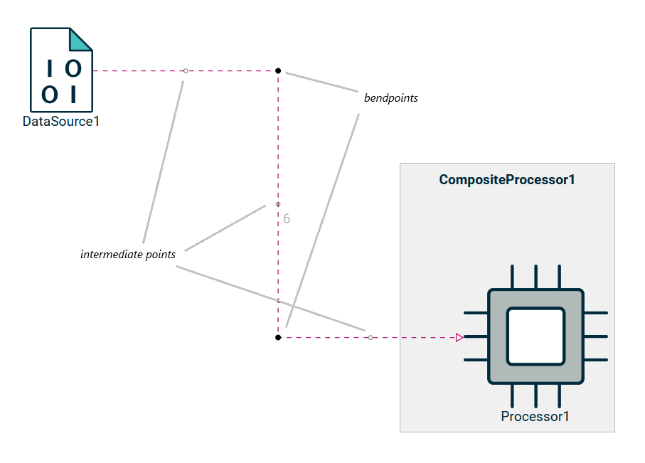
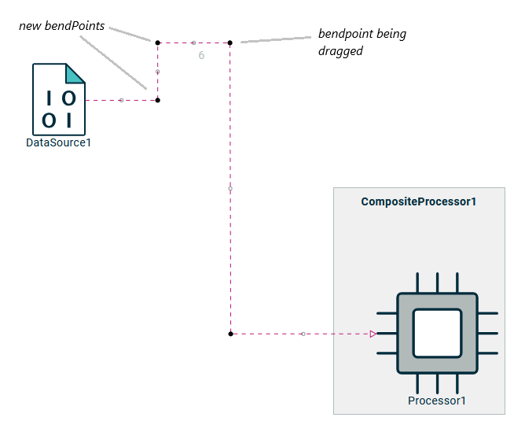
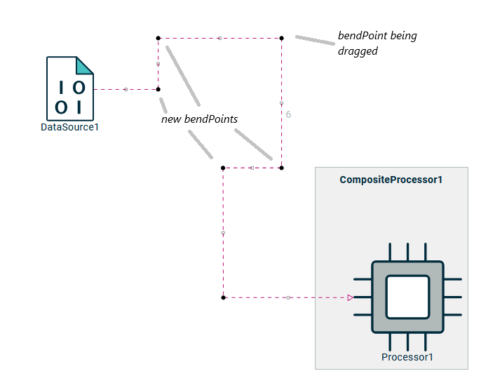
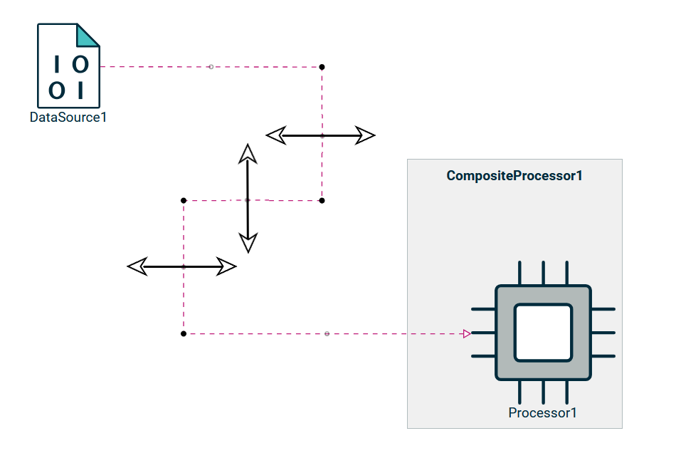
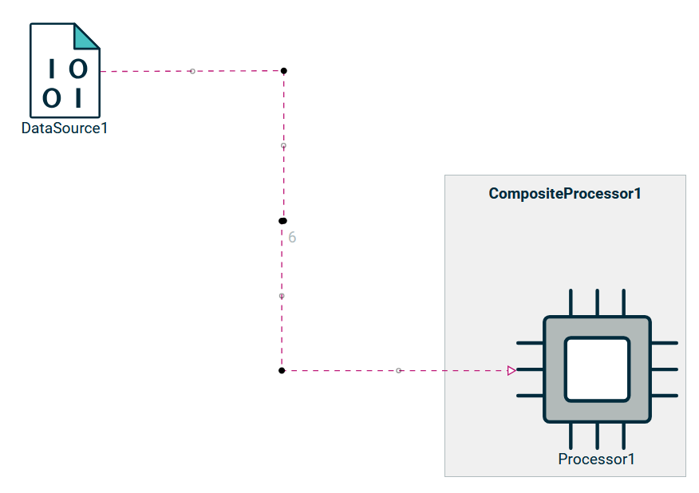
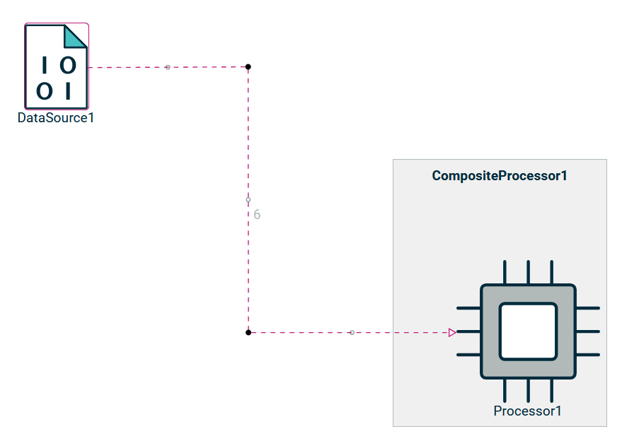

= Force Custom Edges to Stay Rectilinear

== Problem

It is possible to add new bendpoints on an edge, but currently moving (or adding) a bendpoint causes the path to lose its rectilinearity.

== Key Result

Regardless of the actions performed on an edge, the resulting path must remain rectilinear.

=== Acceptance Criteria

Cypress tests will be implemented.

== Solution

On edge, bendpoint (black-filled circle) are positioned to each segment corner and intermediate point (grey circle) on middle to each segment.

Modify the algorithm for moving a bendpoint so that two new bendpoints are created (for one axis) at the positions of the adjacent intermediate point of the moved bendpoint.

The same approach could be applied on the two axis in the same drag.

Change the behavior of intermediate points so that they do not create new bendpoints but instead move existing adjacent bendpoints along an axis (x or y).
This axis is perpendicular to the segment in question.

To delete a bendpoint, align two segments to form a single segment (a margin will be implemented to facilitate this action).

== Cutting Backs

It would be interesting to define the routing of an edge (rectilinear, oblique, etc...).

== Rabbit Holes

* Node handles are currently fixed, so it's not possible to modify the first and last edge segments directly.
* When the node is moved, the first bendpoint must be updated to preserve rectilinearity of the edge path.

== No-Gos
