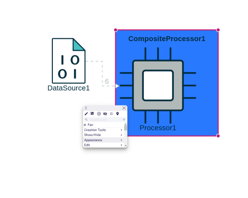
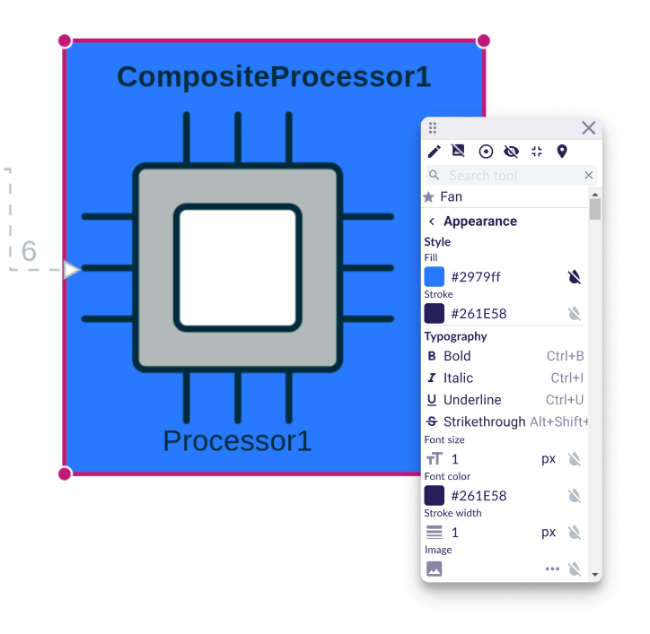
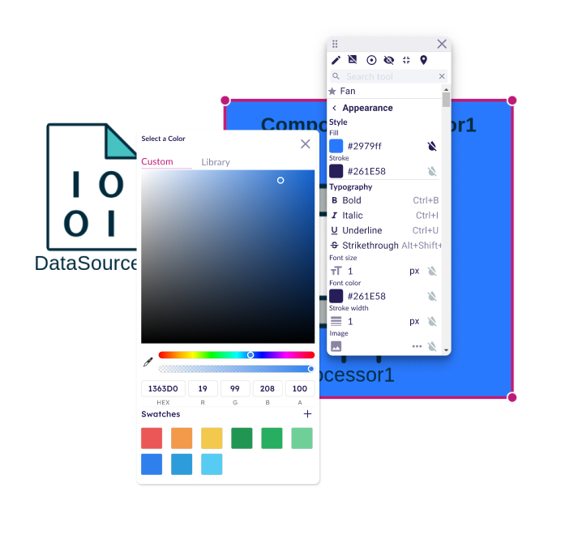
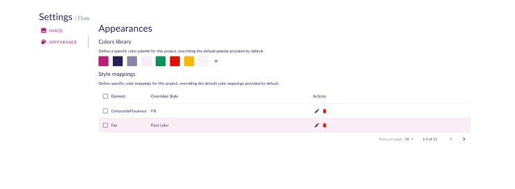
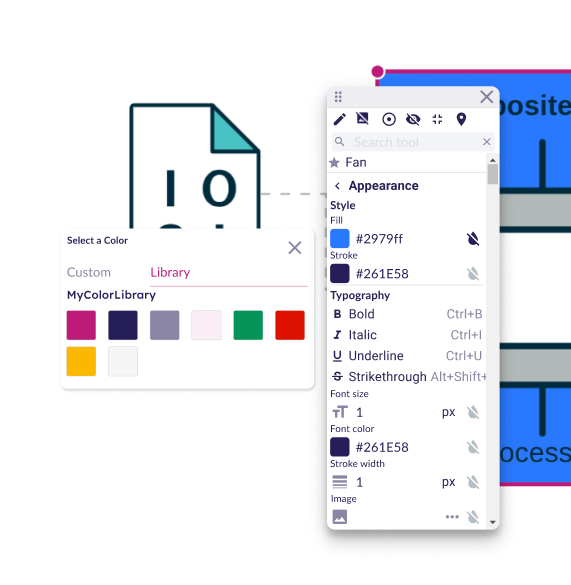

= User Diagram Appearance View

== Problem

The specifier offers a wide range of styles for the appearance of nodes and edges in a diagram.
However, when an end-user creates a diagram, they are limited to the styles defined by the specifier.

== Key Result

An end-user must be able to change the style of elements in a diagram.

== Solution

The end-user will have access to a new section in the palette.

Once the new `appearance` section opened, all the node style options will be available.

NOTE: it doesn't have to be a form, but hardcoded component build with MUI.

To change a color, user would have access to color picker or to chose between a color library (see Cutting Backs)

== Cutting Backs

* In the first version, focus only on nodes.
The same principle will then be applied to edges.

* Some colors could be defined in a project settings library.

These colors are available for quick access in the palette.

== Rabbit Holes

* It must be easy for a downstream application to contribute new entries to this style palette.
* Style changes should only apply to the selected element and not by default to the type of the selected element.
In a second phase, it should be possible to directly change the style of all elements of a given type.
* Style changes must be persistent.

== No-Gos
