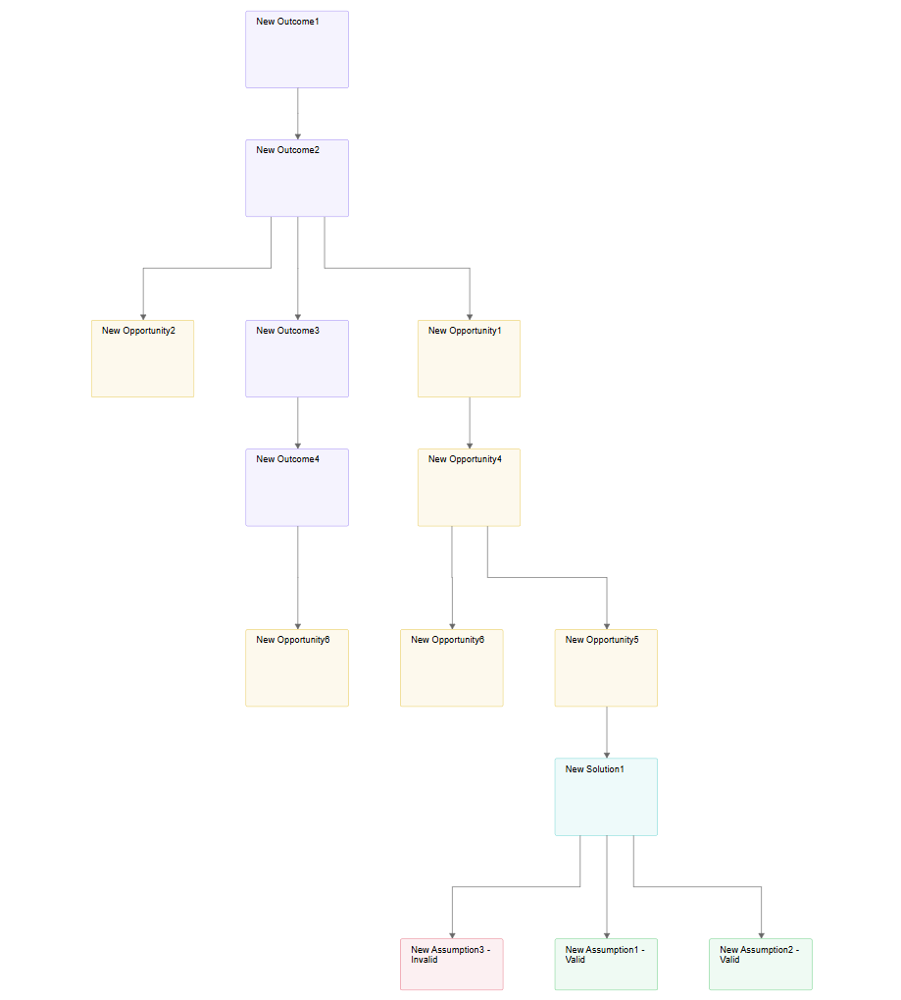

= Add support for diagram customization

== Problem

Enable customization of a diagram’s layout.

=== Context

In Sirius Web, diagram layout (i.e., sizing and positioning of nodes and edges) is managed through both backend and frontend processes.
The backend’s `DiagramEventProcessor` handles diagram rendering and persistence, responding to two main event types:

- **Refresh**: Triggered by actions such as creating or deleting semantic elements, creating edges, or synchronized representation creation.
These events update the diagram structure and persist it, but do not directly alter layout data.

- **Layout**: Triggered by actions such as clicking "Arrange All" or moving children within a container.
These events trigger layout computations that update `DiagramLayoutData`, including `NodeLayoutData` and `EdgeLayoutData`.

The frontend applies layouts via:

- **`useLayout`**: Handles most scenarios, including node creation, semantic changes, and edge creation.
It recalculates node coordinates, resolves overlaps, and manages container constraints using backend-provided `NodeLayoutData`.

- **`useArrangeAll`**: Used specifically for the "Arrange All" tool. It employs the ELK algorithm to suggest node positions and sizes.
These suggestions are not applied to pinned nodes and still rely on `useLayout` for overlap resolution.

Currently, layout logic is tightly coupled to hardcoded frontend (ELK/incremental) logic and the backend’s rendering pipeline.
There is no extension point to inject custom layout algorithms, especially backend-computed ones, which could leverage diagram definitions and semantic data to produce domain-specific layouts tailored to a given diagram type.

=== Needs

We need to:

- Register a layout strategy for a given diagram type.
- Reuse or override existing layout mechanisms (ELK, incremental, etc.).
- Execute custom layout algorithms while retaining default diagram behavior (e.g., node sizes, synchronization).
- Define layout strategies based on semantic element attributes or domain-specific semantics.
- Support layout rules based on node or edge descriptions.
- Allow partial layout customization (e.g., place containers specifically, but delegate inner layout to defaults).

The current architecture does not support this level of customization due to the tight coupling of layout logic across backend and frontend layers.

==== Example: Custom Layout Logic for an OST Diagram

In an Opportunity Solution Tree (OST) diagram, layout must reflect the logical hierarchy of the Product Discovery process.
The root Outcome appears at the top, and its sub-elements are positioned based on their types and semantic roles.

Layout rules include:

- The root Outcome (e.g., New Outcome1) is placed at the top center.
- Immediate child Outcomes (e.g., New Outcome2, New Outcome3, New Outcome4) appear one level below in a vertical orientation.
- Opportunities linked to those Outcomes (e.g., New Opportunity1, New Opportunity2) are placed at the same vertical level as the Outcomes they relate to.
- Each Opportunity has an integer priority.
The lower the value (1 being the highest priority), the further left it should appear.

This layout conveys both semantic relationships and business logic.
Making such rules explicit and configurable is essential for supporting similar diagrams across domains.

== Key Result

The problem is considered solved when:

- As a developer, I can write code to customize the layout of a diagram.
- As a user, regardless of interactions within the diagram, the layout remains consistent with the developer-specified customization.

=== Acceptance Criteria

Tests will be implemented to validate the expected behaviors.

== Solution

The developer must provide backend implementations of an API (see ADR
link:{docdir}/../../adrs/XXX_add_support_for_backend-driven_diagram_layout_customization.adoc[Add support for backend-driven diagram customization]).

=== Scenario

=== Breadboarding

=== Cutting backs

== Rabbit holes

- Blinking effect during "Arrange All" due to ELK’s initial layout, accepted as tolerable.
- Risks inconsistent UX if changes deviate significantly from defaults.

== No-gos
