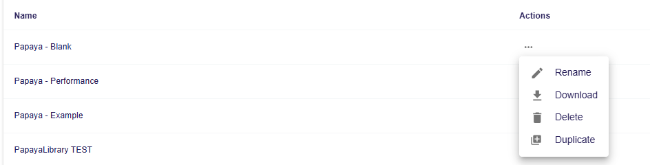

= Add support for project duplication

== Problem

Users can't duplicate projects.

== Key Result

- On the `projects` page, a new action should be available in the contextual menu to duplicate a project.
- The duplicated project contains a copy of the original project's semantic data
- The duplicated project contains a copy of the original project's representations
- The duplicated project has the same natures as the original project
- The duplicated project contains a copy of the original project's settings
- The duplicated project's name is `<Original project's name> (copy)`

=== Acceptance Criteria

- A Cypress test should leverage the new functionality and validate the whole user experience.
- Backend integration tests should also be available to ensure that the core parts of the behavior are workign as expected.

== Solution

=== Scenario

=== Duplicate a project from the projects page

On the `projects` page, the user opens the contextual menu of a project they want to duplicate.
The contextual menu contains a "Duplicate" entry.
The user clicks on the entry, a new project appears in the list of project with the name `<Original project's name> (copy)`.
The user opens the project, which contains the same semantic data, representation, and settings as the original project.

=== Breadboarding

=== Cutting backs

== Rabbit holes

== No-gos

