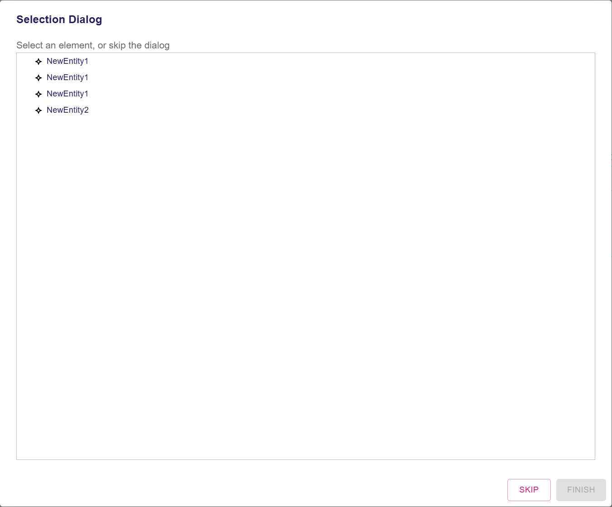
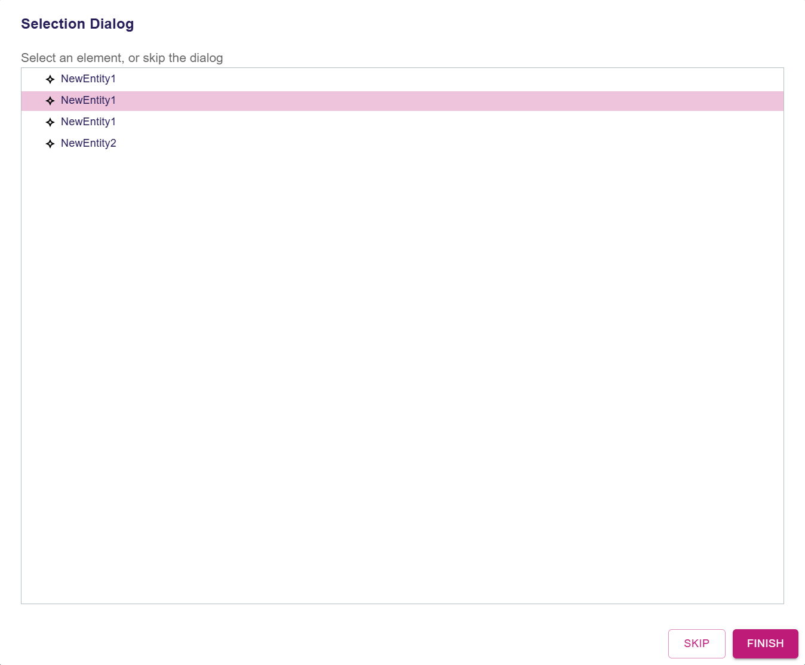
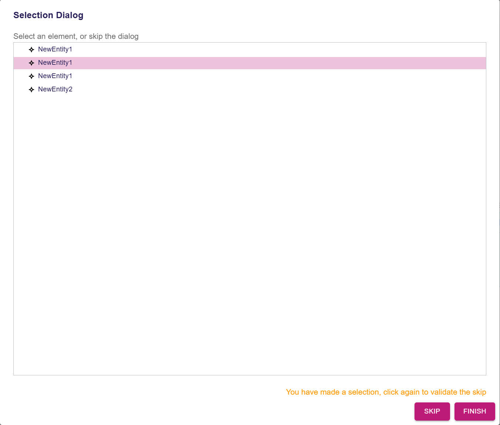

= Add an option to skip a selection dialog

== Problem

When the specifier defines a diagram tool in the View DSL that declare a Selection Dialog, the tool cannot be executed without validating the dialog with a selection.
Because of that, downstream projects are not able to define a tool that can handle both cases: with or without selection, even if both behaviors are similar.
It forces downstream projects to define two different tools for each case.

== Key Result

The Selection Dialog can be skipped and return an empty selection.

=== Acceptance Criteria

- Integration tests should be added to cover the new behavior.
- A new button will be able to skip the selection dialog.

== Solution

- A tool in the View DSL can declare a Selection Dialog as usual.
- The specifier can choose to make the dialog skippable by checking the property `skippable` to `true`.
- Whether the dialog is skipped or not, the tool is executed, with an empty selection if the dialog has been skipped.

=== Scenario

==== Skipping a Selection Dialog

- The user clicks on a tool that opens a Selection Dialog.
- The Selection Dialog is opened.
- The user clicks on the "Skip" button.
- The dialog is closed.
- The tool continues its execution with an empty selection.

==== Skipping after making a selection

- The user clicks on a tool that opens a Selection Dialog.
- The Selection Dialog is opened.
- The user makes a selection.
- The user clicks on the "Skip" button.
- A warning message is displayed in the dialog: "You have made a selection, click again to validate the skip".
- The user clicks again on the "Skip" button.
- The dialog is closed.
- The tool continues its execution with an empty selection.

=== Breadboarding

.The skippable selection dialog with no selection made

.The skippable selection dialog after making a selection

.The skippable selection dialog after clicking on the skip button once a selection has been made

=== Cutting backs

== Rabbit holes

== No-gos
