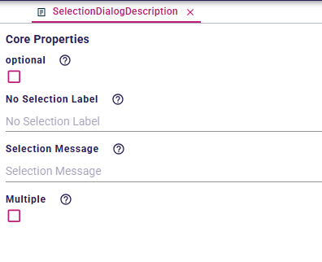
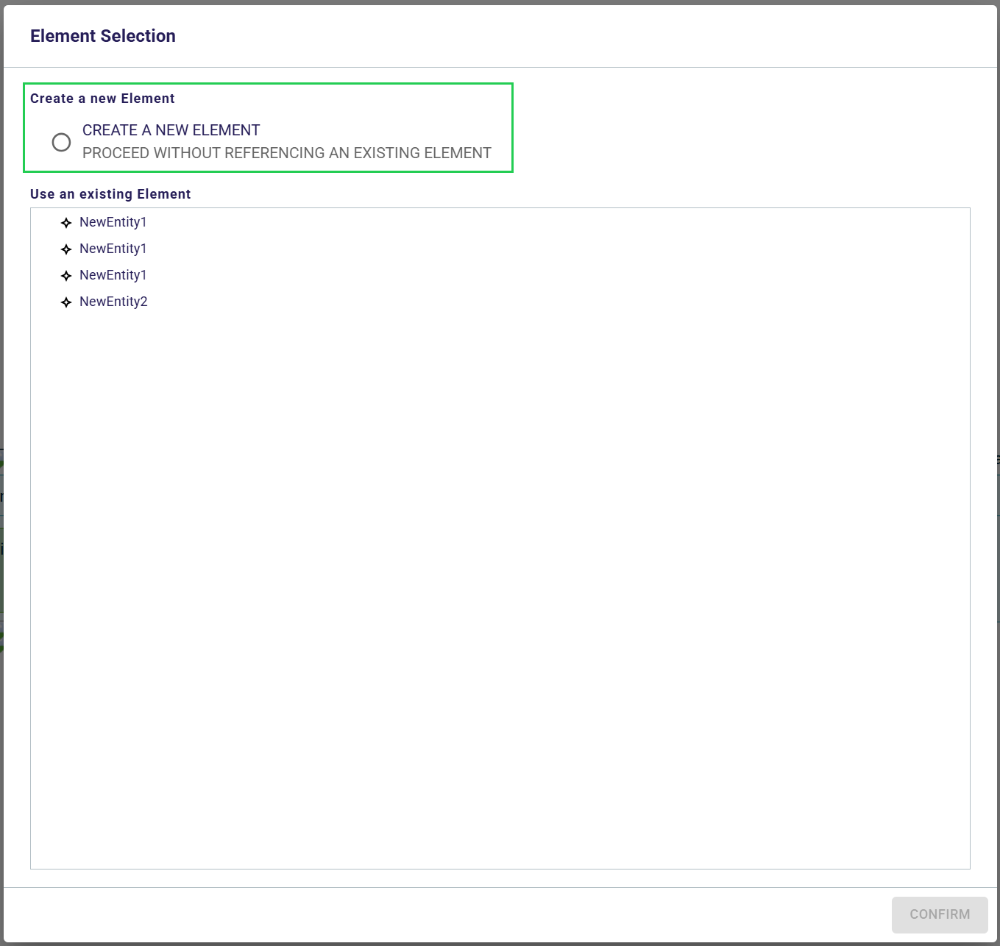
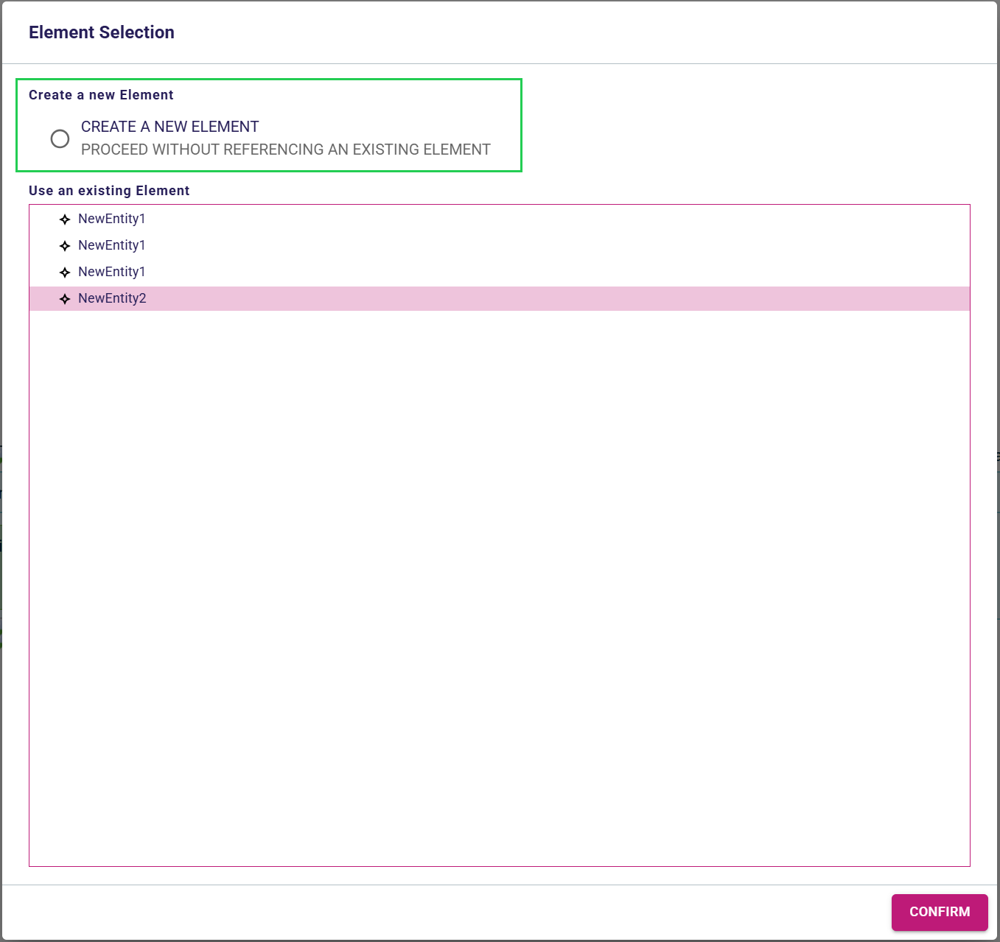
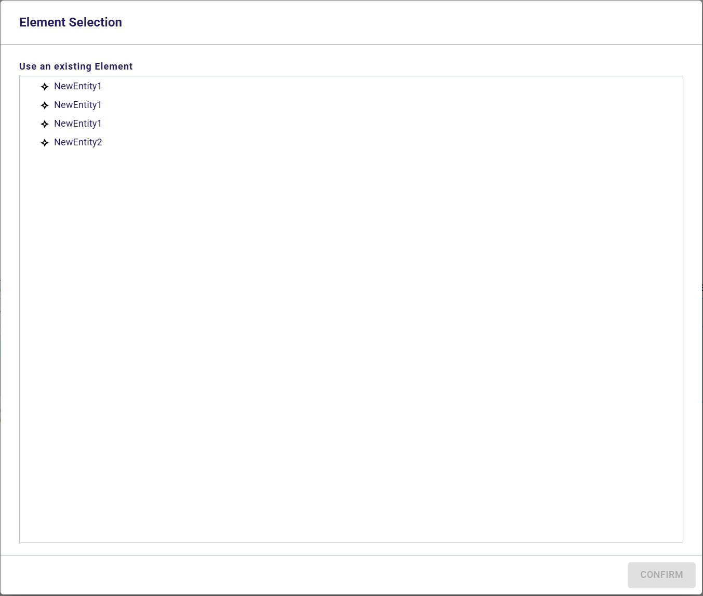

= Add support the for selection dialog that can be confirmed without making a selection

== Problem

When the specifier defines a diagram tool in the View DSL that declare a Selection Dialog, the tool cannot be executed without confirming the dialog with a selection.
Because of that, downstream projects are not able to define a tool that can handle both cases: with or without selection, even if both behaviors are similar.
It forces downstream projects to define two different tools for each case.

== Key Result

The specifier is able to decide if a Selection Dialog can be confirmed without making a selection.

=== Acceptance Criteria

* Integration tests should be added to cover the new behavior.
* When the specifier will decide a Selection Dialog can be confirmed without making a selection, a new option will be visible to the Selection Dialog allowing to confirm the dialog without making a selection.
* The message displayed to the user when the selection is optional can be customized by the specifier, otherwise the default message "Confirm without selection" will be displayed.

== Solution

* The specifier can add a Selection Dialog to a tool as usual.
* The specifier can check the property `optional` in Selection Dialog properties.
** A helper describes the behavior of the selection dialog when the `optional` property is checked.
* The specifier can provide a label for the widget that has been added by making the selection optional, by filling the _No Selection Label_ text field.
** If the specifier does not provide a label, a default label "Confirm without selection" will be used.
** A helper describes what will be the default label if the specifier does not provide one. 
* When the Selection Dialog is confirmed, the tool is executed whether a selection has been made or not.

=== Scenario

For the following scenarios, we consider the selection in the Selection Dialog has been made optional by the specifier.

==== Confirm the Selection Dialog without making a selection

* The user clicks on a tool that opens a Selection Dialog.
* The Selection Dialog is opened, the button to confirm is disabled.
* The user clicks on the option to `confirm without selection`.
* The button to confirm the Selection Dialog is enabled.
* The user clicks "Confirm" to confirm the Selection Dialog.
* The tool continues its execution with an empty selection.

==== Switch between making a selection and confirming without selection

* The user clicks on a tool that opens a Selection Dialog.
* The Selection Dialog is opened, the button to confirm is disabled.
* The user makes a selection.
* The button to confirm the Selection Dialog is enabled.
* The user clicks on the option to `confirm without selection`.
* The selection is cleared.
* The user clicks "Confirm" to confirm the Selection Dialog.
* The tool continues its execution with an empty selection.

=== Breadboarding

In the following images, the green section can be customized by the specifier in the description of the Selection Dialog.
_Create a new element_ is an example of message the specifier can set in the _No Selection Label_ text field when making the selection optional.

.Updated properties of the Selection Dialog in the View DSL

.The selection dialog that can be confirmed without making a selection at opening

.The selection dialog that can be confirmed without making a selection selecting the option to confirm without selection

.The selection dialog that can be confirmed without making a selection after making a selection

.The selection dialog when it requires a selection

=== Cutting backs

== Rabbit holes

== No-gos
