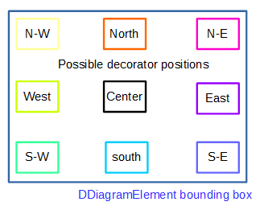
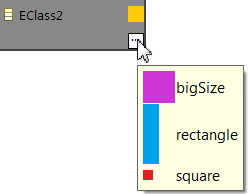

:author: Gwendal Daniel
:date: 2026-03-30
:status: accepted
:consulted: Stéphane Bégaudeau, Florian Rouëné
:informed: Séraphin Costa
:deciders: Stéphane Bégaudeau
:issue: https://github.com/eclipse-sirius/sirius-web/issues/6355

= (S) Add support for node decorators

== Problem

Sirius Web doesn't allow specifiers to define decorators on their nodes.
These decorators could be helpful to quickly highlight point of interest on a node (e.g. a decorator could indicate a semantic error, a duplicated label, etc).

== Key Result

Specifiers should be able to define decorators to render on their nodes via the view DSL.
These decorators could be placed on a set of fixed positions (center, north, south, east, west, north-east, etc).

It should be possible to define multiple decorators at the same position on the same node.
In this case, only the first one should be visible, and other decorators should be visible in a tooltip.

=== Acceptance Criteria

- A decorator should be added on an existing diagram (such as Flow) to demonstrate the new feature.
- Backend integration tests should be available to ensure that the core parts of the behavior are working as expected.
- Playwright tests should leverage the new functionality and validate the whole user experience.

== Solution

We will update the diagram view DSL to let specifier define decorators on their diagrams.

NOTE: At the moment, we don't know if we'll opt for diagram-level decorators (i.e. decorators defined at the root of the diagrams with target node descriptions/semantic candidates), or node-level decorators.

A decorator will consist of:

- A name
- A label (may be used to render tooltips)
- An image
- A position (north, south, etc)
- A precondition
- A lists of referenced nodes (in case we opt for diagram-level decorators, otherwise the decorator will be a child of the node description it decorates)

Decorators can be defined on any node, including custom nodes and nodes used as list/free form compartments.
In this case, the decorators should never be placed above the node's content (this includes inner nodes, but also quick actions available on the node).

=== Scenario

Specified decorators should be rendered at the appropriate position on the appropriate nodes.

Existing diagrams without decorators should remain unchanged.

=== Breadboarding

Available positions for the decorators:

Example of tooltip to uses when multiple decorators have the same position on the same node (the actual look and feel of the tooltip will probably be different than the one in the screenshot, which comes from Sirius Desktop)

=== Cutting backs

For a first version, we don't want to deal with potential overlap of decorators.
It will be the responsibility of the specifier to set decorators that do not overlap.

== Rabbit holes

None

== No-gos

In Sirius Desktop, decorators are slightly moved to prevent them from overlapping with border nodes.
We don't want to deal with this feature in the first version of the decorators.
As a workaround, specifiers can use a decorator image with a transparent border to ensure there is no overlap between the decorator and the border node.

Managing how multiple decorators are distributed is out of the scope of this work.
For now only the first decorator at a given position will be visible on a node, the other decorators will be visible in the decorator tooltip.

Decorators for other diagram elements (like edges) is out of the scope of this work.
