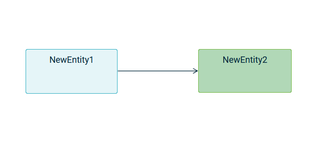

:author: Florian Rouëné
:date: 2026-03-27
:status: proposed
:consulted: Stéphane Bégaudeau
:informed: Michaël Charfadi
:deciders: Stéphane Bégaudeau
:issue: https://github.com/eclipse-sirius/sirius-web/issues/6349[link to the related issue]

= (S) Automatically adjust the edge to prevent small misalignment

== Problem

When the source and target coordinates of an edge are very close (horizontally or vertically), small visual gaps or "jumps" appear, degrading the graph's readability and aesthetics.
This issue is most noticeable on edges without manual customization, (no _bending points_ or _custom handles_).

**Impact**:

- Poor user experience (perceived clutter or imprecision).
- Time wasted manually adjusting edges for teams working with complex graphs.

== Key Result

=== Objective

Eliminate 100% of visual misalignment for non-customized edges when source/target coordinates are within a defined gap threshold.

=== Acceptance Criteria

- No visible misalignment for non-customized edges with a gap ≤ 5px (threshold to be refined).
- Unchanged performance.
- Compatibility with existing edges (no regression on _bending points_ or _custom handles_).
- Automated tests covering.

== Solution

=== Scenario

- User loads a graph with closely positioned nodes.
- Non-customized edges automatically adjust to prevent some misalignment.

=== Breadboarding

- Before: Edge with misalignment

- After: Smoothed edge

=== Cutting Backs

None

== Rabbit Holes

- **Performance risk**: Gap calculation for every edge on each render.
- **Conflicts with *custom handles***: Ensure corrections don’t override manually set handles.
- **Gap threshold**: Too low may cause unnecessary corrections; too high may leave some misalignment.

== No-gos

None
