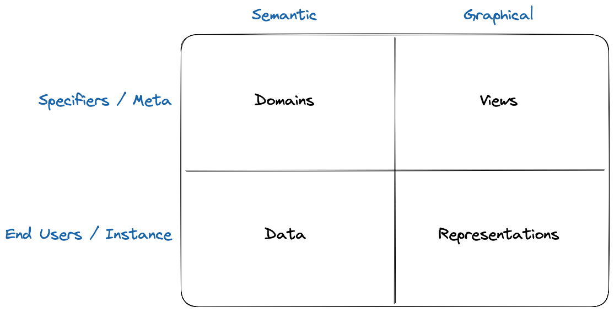
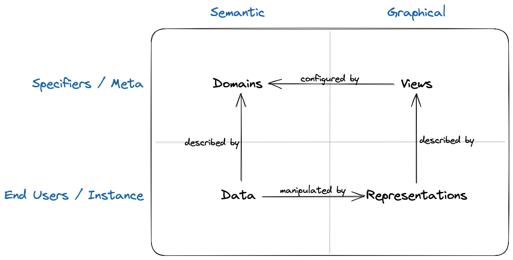

= Overview

This repository is a monorepo containing both the code of Sirius Web and Sirius Components, the reusable components used to build Sirius Web.

Sirius Web is an open source platform used to define modeling environments for your business concerns.
With Sirius Web, you can define the concepts of your domain and some dedicated tooling.
On the other hand, Sirius Components is a set of backend and frontend components which can be reused in various applications to build a modeling workbench based on representations.

== Overview

Sirius Web provides a modeling workbench to build model based applications.
There are two kinds of users which will interact with Sirius Web, each one working with a specific aspect of the application.
Firstly, studio makers will use Sirius Web to define all the concepts of their business and the graphical tooling to manipulate them.
Secondly, end users which will use those concepts to capture some business knowledge and manipulate those pieces of data thanks to some dedicated tooling.

Sirius Web can thus be described with four major parts.
The specifiers work at a "meta" level where they describe the business concepts in a domain and the descriptions of the representations in a view.
The end users will manipulate instances of those concepts thanks to the representations.

The semantic data manipulated by the end users are thus described by the domains while the graphical representations are described by the views.
Since the representations are tailor-made for the business of the users, they are configured by the concepts defined in the domains.
End users can thus manipulate their data with the representations.

Sirius Web is the descendant of the Sirius "desktop" project.
Both projects try to fulfill similar requirements and share the same philosophy.
Sirius Web provides a compatibility layer for the specifiers who have used Sirius desktop in the past.

=== Domain

In a domain, specifiers will define all the concepts of their business with their attributes and the various relations between these concepts.
Specifiers can use the new `Domain` language exclusive to Sirius Web to specify those concepts.
They can also leverage existing `ecore` files that may have been created for Sirius desktop.

Since most of the time semantic data are manipulated using the Eclipse EMF framework, domains are sometimes referred as metamodels or even `EPackages`.

Using a domain, a specifier could create concepts such as `Vehicule` and `Engine` with their properties `name`, `speed`, `energyType`, `numberOfWheels` etc.
The specifier should have a deep understanding of the business and its various rules.

=== View

In a view, specifiers will create the descriptions of the representations they want to provide to their end users.
The view can be used to describe various representations such as diagrams or forms to edit the data.

Sirius Web comes with the `View` language to create and parameterize the various representations.
In Sirius desktop, specifiers would use an `odesign` file to create the descriptions of the representations.
It is possible to import those `odesign` files in Sirius Web to reuse some tooling created in Sirius desktop.

Using a view, a specifier can create the description of a diagram which will be used by the end users to define various kinds of vehicles.
The specifier can parameterize the description of the diagram with the concepts of the domain and specify some business rules.
For example, the specifier could indicate that a `vehicule` will appear with the image of a car if it has four `wheels` or with the image of a bicycle if it has only two `wheels`.

=== Data

The end users will have the ability to instantiate the concepts of the domains to create some semantic data.
For example, using the domain we have described, they would be able to create a large selection `vehicules` with various configurations.

They will only be able to manipulate the concepts defined by the specifiers preventing them from creating a completely incoherent set of data.
In our example, the end user can only manipulate data related to `vehicles`.

=== Representations

In order to manipulate those data, the end users will have access to the representations defined by the specifier.
The representations will provide the end users with some tooling dedicated to specific aspect of the domain.
A specifier could create representations such as:

- a form for the technical description
- a diagram showing the various components
- a diagram dedicated to the cable management between the different parts
- a form to capture reports written during the maintenance of the vehicle

The representations can display a subset of the data using an approach dedicated to a specific role inside the business.
