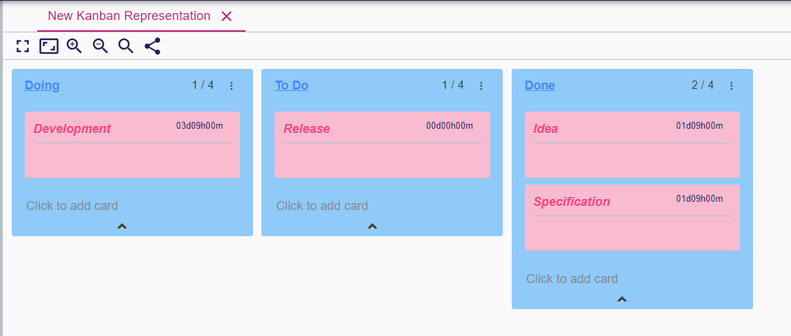
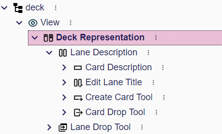
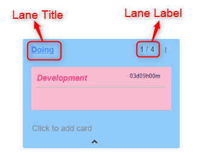
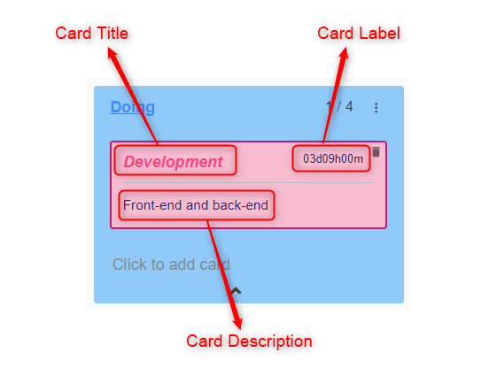

# Deck representation description

This chapter explains how to configure a `Deck` representation in the `View` model.

A `Deck` representation is composed with many `Lanes` containing many `Cards`.
Each `Lane` and `Card` is associated with a semantic element that is an object of the model represented by a `Deck` representation.

## Deck description

To define how your model is represented with a `Deck` representation, the specifier needs to create a `DeckDescription` in the `View` model.

* `Name` : A name that helps the specifier to know what the DeckDescription is about
* `Domain Type`: Type of the object on which it is possible to create the representation 
* `Precondition Expression`: An expression that determine if it is possible to create the representation
* `Title Expression`: The initial name of the representation once created

### Deck style

It is possible to define the *background color* of the `Deck` representation by adding a `StyleDescription` in the `DeckDescription`.

In addition, adding a `ConditionalStyleDescription` allows to override the style if the `Condition` expression returns `true`.
You may add multiple `ConditionalStyleDescription`.

## Lane description

The `LaneDescription` is used to define the lanes.

* `Semantic Candidates Expression`: An expression that returns one or more semantic elements.
Each semantic element will be represented by a lane.
** `self` variable is the semantic element associated with the `Deck`.
* `Title Expression`: An expression that defines the title of the lane
** `self` variable is a semantic element among the list returned by the `Semantic Candidates Expression`
* `Label Expression`: An expression that defines the label of the lane
* `Is Collapsible Expression`: An boolean expression.
If true, it is possible to collapse the lane hence hiding all the contained cards.

### Lane style

It is possible to define the style of the lane by adding a `StyleDescription` in the `LaneDescription`.
The customizable attributes are

* Font Size
* Italic, Bold, Underline and Strike Through
* The text color
* The background color of the lane

In addition, adding a `ConditionalStyleDescription` allows to override the style if the `Condition` expression returns `true`.
You may add multiple `ConditionalStyleDescription`

## Card description

The `CardDescription` is used to define the card inside a lane.

* `Semantic Candidates Expression`: An expression that returns one or more semantic elements.
Each semantic element will be represented by a `Card`.
** `self` variable is the semantic element associated with the `Lane`
* `Title Expression`: An expression that defines the title of the card 
** `self` variable is a semantic element among the list returned by the `Semantic Candidates Expression`.
* `Label Expression`: An expression that defines the label of the card
* `Description Expression`: An expression that defines the description of the card

### Card style

As for `LaneDescription`, it is possible to define the style of the card by adding a `StyleDescription` or one or more `ConditionalStyleDescription` in the `CardDescription`.

## Tools

Many tools can be configured for `Lane` and `Card`.
By default, a tool does nothing.
A tool provides access to variables useful in the context of the tool and executes the operations associated with the tool.
Typical operation:

* `Change Context`: It allows to change the `self` value.
But typically this operation is useful if you just want to call a java service that will implement the tool behavior.
* `Create Instance`: Creates a semantic object and add it in the defined feature of the `self` semantic element
* `Set Value`: Sets the value on a given feature on `self` semantic element
* `Delete Element`
* etc

### Lane tools

* `Lane Drop Tool`:
This tool defines the behavior when dragging and dropping a lane before or after another lane.
Available variables:
** `self`: The semantic element associated with the dropped lane
** `index`: The new index of the dropped lane.
First position corresponds to zero and last position corresponds to the number of lanes.

* `Edit Lane Tool`: This tool defines the behavior when the title of a lane is changed.
Available variables:
** `self`: The semantic element associated with the dropped lane
** `newTitle`: The new value of the title.  

### Card tools

* `Create Card Tool`: This tool defines the behavior for the button to add a card.
Available variables:
** `self`: The semantic element associated with the lane
** `title`: The value of the title.  
** `description`: The value of the description.  
** `label`: The value of the label.  

* `Edit Card Tool`: This tool defines the behavior when the title, description or label of a card is changed.
Available variables:
** `self`: The semantic element associated with the dropped lane.
** `newTitle`: The new value of the title.  
** `newDescription`: The new value of the description.  
** `newLabel`: The new value of the label.  

* `Delete Card Tool`: This tool defines the behavior for the delete button on a card.
Available variables:
** `self`: The semantic element associated with the card

* `Card Drop Tool`: This tool defines the behavior when dragging and dropping a card among cards of the same or other lane.
Available variables:
** `self`: The semantic object associated with the card
** `oldLane`: The initial lane from which the card is dragged
** `oldLaneTarget`: The semantic object associated with the initial lane
** `newLane`: The lane where the card is dropped
** `newLaneTarget`: The semantic object associated with the new lane
** `index`: Index of the card among the cards of the new lane.
First position corresponds to zero and last position corresponds to the number of cards in the lane.  

