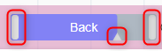
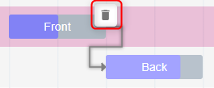

# Gantt representation description

This chapter explains how to configure a `Gantt` representation in the `View` model.

A `Gantt` representation is made of a hierarchy tasks.

* A task can contain sub-tasks.
* A task can be linked to another task with a dependency relation.

Each `Task` is associated with a semantic element that is an object of the model.

image::images/gantt-overview.png[Gantt representation overview]

## Gantt description

To define how your model is represented with a `Gantt` representation, the specifier needs to create a `GanttDescription` in the `View` model.

* `Name`: A name that helps the specifier to know what the GanttDescription is about
* `Domain Type`: Type of the object on which it is possible to create the representation 
* `Precondition Expression`: An expression that determines if it is possible to create the representation
** `self` variable is the semantic element associated with the `Gantt`.
* `Title Expression`: The initial name of the representation once created
** `self` variable is the semantic element associated with the `Gantt`.
* `Date Rounding Expression`: An expression that returns a string that is a time duration that will define how the date is rounded when changing the date from the Gantt representation.
The string contains 
** an integer which is the number of time unit.
** a character among {D,H,m} corresponding to a Day, Hour or minute time unit.
Example: to round to half a day, the expression must returns `12H`

## Task description

The `TaskDescription` is used to define the direct tasks of its parent in the tasks hierarchy.
It can be the root tasks in the Gantt or the sub-tasks in a task.

* `Name`: A name that helps the specifier to know what the TaskDescription is about
* `Semantic Candidates Expression`: An expression that returns one or more semantic elements.
Each semantic element will be represented by a task.
** `self` variable is the semantic element associated with the `Gantt`.
* `Domain Type`: Type of the object used to filter the semantic object represented by a task 

All the following expressions are called as many times as the number of semantic elements returned by the `Semantic Candidates Expression`.
`self` variable is the current semantic element.

* `Name Expression`: An expression that defines the name of the task
* `Description Expression`: An expression that defines the description of the task
* `Start Time Expression`: An expression that returns a `java.time.Instant` to define the start date of the task.
* `End Time Expression`: An expression that returns a `java.time.Instant` to define the end date of the task.
* `Progress Expression`: An expression that returns an integer between 0 and 100 to define the percentage progress of the task.
* `Compute Start End Dynamically Expression`: An expression that returns a boolean.
If true and if the task contains sub-tasks, the start and end dates displayed in the Gantt are computed from the sub-tasks.
The start date(respectively the end date) is the lower(respectively upper) date of the sub-tasks dates.
* `Task Dependencies Expression`: An expression that returns a list of semantic elements to define dependency relations between the current task and the tasks associated the returned semantic elements.

### Task description as sub task

To define tasks as the second level of the tasks hierarchy, create a `TaskDescription` in the `TaskDescription`.

It is also possible to reuse `TaskDescription` so that it is possible to define a recursive definition.
Use `Reused Task Element Descriptions` field to select existing `TaskDescription`. 

## Tools

Many tools can be configured for `Task`.
All the tools are created under `GanttDescription`.
Note that, by default, a tool does nothing.
You need to add operations in the tool to make changes in the semantic model.
Typical operations:

* `Change Context`: It allows to change the `self` value.
But typically this operation is useful if you just want to call a java service that will implement the tool behavior.
* `Create Instance`: Creates a semantic object and add it in the defined feature of the `self` semantic element
* `Set Value`: Sets the value on a given feature on `self` semantic element
* `Delete Element`
* etc

Each tool gives access to variables that can be used in the expression of the tools.
When the tool is executed, the system will set the variables(that depends on the execution context of the tool) and executes the operations associated with the tool.

### Task tools

* `Create Task Tool`: This tool defines the behavior when the user creates a task using the button in the task contextual palette in Gantt.
Available variables:
** `self`: The semantic element associated with the selected Task
* `Delete Task Tool`: This tool defines the behavior when the user deletes a task using the button in the task contextual palette in Gantt. 
Available variables:
** `self`: The semantic element associated with the selected Task

* `Edit Task Tool`: This tool defines the behavior when the user uses the handles to change start or end dates or the progress.
Available variables:
** `self`: The semantic element associated with the selected task.
** `newName`: The new value of the name.  
** `newStartTime`: The new value of the start time.  
** `newEndTime`: The new value of the end time.  
** `newDescription`: The new value of the description.  
** `newProgress`: The new value of the progress.

* `Drop Task Tool`:
This tool defines the behavior when dragging and dropping, in the table part of Gantt, a task before, after or inside another task.
Available variables:
** `sourceObject`: The semantic element associated with the dragged task
** `targetObject`: The semantic element associated with the target task where the task is dropped.
** `sourceTask`: The dragged `Task`.
** `targetTaskOrGantt`: The target where the task is dropped.
It can be `Gantt` or another `Task`.
** `indexInTarget`: The index of the dropped task inside the new list of tasks where it is dropped.
index=0 means first position.

### Dependency tools

* `Create Task Dependency Tool`:
This tool defines the behavior when creating a task dependency by dragging the dependency handler from one task to another.
Available variables:
** `sourceObject`: The semantic element associated with the task from which the dependency link is initiated.
** `targetObject`: The semantic element associated with the dependant task where the dependency finishes.

* `Delete Task Dependency Tool`:
This tool defines the behavior when deleting a task dependency using the button in the task dependency contextual palette in Gantt.
Available variables:
** `sourceObject`: The semantic element associated with the task from which the dependency link is initiated.
** `targetObject`: The semantic element associated with the dependant task where the dependency finishes.

