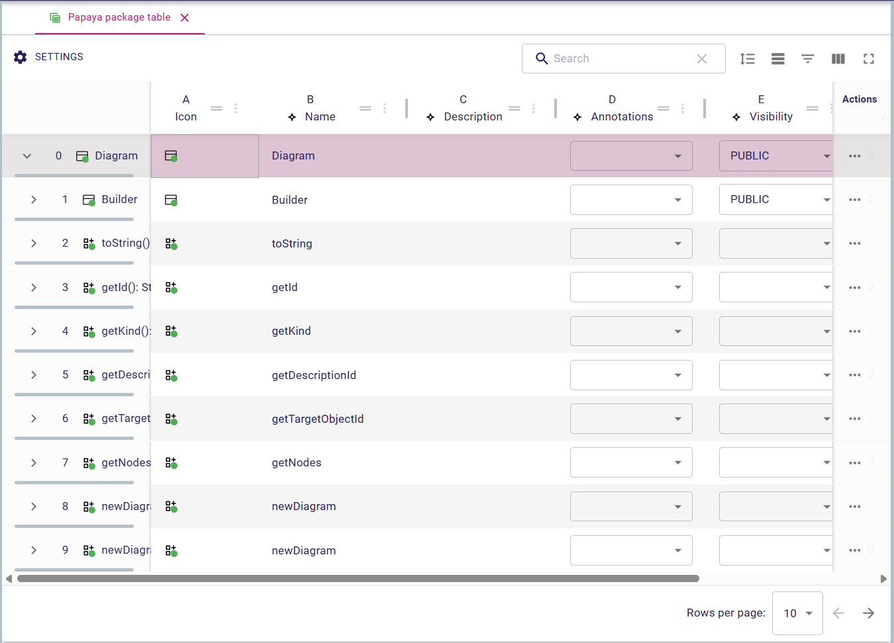
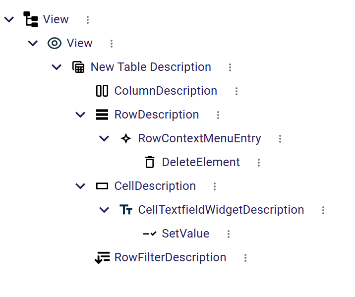

= Table representation description

This documentation explains how to configure the `Table` representation in the `View` model.

== Overview

A `Table` representation is made of a set rows composed of multiple columns organized in a grid.

In the image below, we can see a simple table view model example:

== Table description

To define how your model is represented with a `Table` representation, the specifier needs to create a `TableDescription` in the `View` model.
The `TableDescription` view model is the root of the table representation and where all specifiers should start.

Here are the properties of the `TableDescription`:

* `Name` : A name that helps the specifier to know what the TableDescription is about
* `Domain Type`: Type of the object on which it is possible to create the representation
* `Precondition Expression`: An expression that determine if it is possible to create the representation
** `self` variable is the semantic element associated with the `Table`.
* `Title Expression`: The initial name of the representation once created
** `self` variable is the semantic element associated with the `Table`.
* `Icon Expression`: The icon associated to this description
** `self` variable is the semantic element associated with the `Table`.
* `Use Striped Rows Expression`: Whether the table is using striped rows (different background color for even or odd rows)
** `self` variable is the semantic element associated with the `Table`.
** `editingContext` variable is the global context of the project
* `Enable Sub Rows`: When the table contains row elements hierarchically structured

== Row description

The main goal of the `RowDescription` is to provide the list of semantic elements associated to the table rows which computed through the `Semantic Candidates Expression`.
The returned type of this expression is `PaginatedData` which handles the pagination.
Since the list of visible rows in the table at any time depends on several criteria (such as filters or sub rows hierarchy), there are some variables available to help the specifier to return the correct rows.

* `self` is the semantic element associated to the `Table`
* `editingContext` contains the global context of the project
* navigation variables used by `CursorBasedNavigationServices.toPaginatedData` pagination service :
** `cursor` contains the first (or the last) visible semantic element (depending of the navigation direction).
This variable could be `null` when no page navigation is done (first table rendering for instance)
** `direction` contains one of the following values:
*** `NEXT` for indicating that the navigation is going forward
*** `PREV` for indicating that the navigation is going backward
** `size` the number of rows visible per page
* filtering variables:
** `globalFilterData` contains the text filed inside the global filter textfield
** `columnFilters` contains a list of `ColumnFilter` object which is:
*** `id` the id of the column in which the filter is entered
*** `value` the text to match the content of the column
** `activeRowFilterIds` contains the list of id of row filters that are active at this time
** `expandedIds` contains the list of id of semantic elements that are currently expanded.
This is useful for hierarchical tables.

The `RowDescription` has also the following properties:

* `Header Label Expression` the expression to compute the label of the row header column
* `Header Icon Expression` the expression to return the icon of the row header column
* `Header Index Label Expression` the expression to return the index of the row header column
* `Initial Height Expression` the expression giving the initial height of the row
* `Is Resizable Expression` the expression to determine whether the row can be resized
* `Depth Level Expression` the expression to compute the depth level of the row (hierarchical table)

All those expression have access to the following variables to perform their computation:

** `self` the semantic element associated to the row
** `rowIndex` an integer value of the index of the row inside the page

== Column description

Once the row description is specified, it is time to tackle the vertical dimension by defining what columns should be displayed in the table.
Unlike the line description which is unique for a given table, there could be multiple column descriptions underneath a table description.

Here are the properties of the column description:

* `Domain Type` contains a type that is used to filter candidate expression result (could be empty)
* `Semantic Candidates Expression` the expression that returns all semantic elements handled by this column description. Each returned element will be handled by a column in the table.
Similarly of row candidate elements expression, we have the same set of variables here.
The `self` variable that contains the *table semantic element*.

* `Precondition Expression` the expression to determine whether the column candidate element should be render or not.
The `self` variable is containing the semantic column element itself.
* `Header Index Label Expression` the expression that returns text of the index shown in the column header
* `Header Label Expression` the expression that returns the text to display in the column header
* `Header Icon Expression` the expression that returns the icon of this column
* `Initial Width Expression` the expression that computes the initial width of the column
* `Is Resizable Expression`  the expression to determine whether the column can be resized
* `Filter Widget Expression` the expression to compute the kind of widget to use for column filters among following values:
** 'range'
** 'range-slider'
** 'text'
Inside those expressions, the specifier can use the `self` variable to access the semantic element of each column.
There is also a new variable named `columnIndex` which contains the numerical index of each column among all columns handled by this column description.

== Cell description

The cell description describes how the actual value between a row and a column is computed.

Here is the list of the cell description properties:

* `Name` the name of the cell description visible in the view model
* `Precondition expression` the expression that is evaluated to determine whether this cell should be rendered or not
* `Selected Target Object Expression` the expression that returns a semantic element when the cell is selected.
If this expression is omitted then the row semantic element is used instead.
* `Value Expression` the expression that returns the value of the cell
* `Tooltip Expression` the expression that returns the tooltip of the cell

All those expressions can access the *row semantic element* using the `self` variable.
The *column semantic element* is referenced by the `columnTargetObject` variable.

== Cell widget description

A cell description must have one single child of type `CellWidgetDescription` used to render the value of the cell.
At the moment, the available cell widget descriptions are:

* `CellTextfieldWidgetDescription`: the cell is rendered as a single line text field
* `CellTextareaWidgetDescription`: the cell is rendered as a multi line text field
* `CellLabelWidgetDescription`: the cell is rendered as a read only text with an icon specified in its property `Icon Expression`.

The default cell widget description is `CellTextfieldWidgetDescription`.
As far as editable widgets are concerned, specifier can define edit operations as children of the cell widget description element in the view model.

== Row filter description

A table description may contain row filter descriptions that are be visible in the row filter menu action in the top toolbar of the table (see user documentation).

These descriptions have the following properties:

* `id` the id associated to this row filter.
This id is stored in the `activeRowFilterIds` variable when it is active.
* `Label Expression` the expression that returns the label of the row filter in the menu.
* `Initial State Expression` the expression to determine whether the row filter is active when table first renders.

Inside these expressions, it is possible to use the following variable:

* `editingContext` the global editing context associated to the project

== Row context menu entry description

It is possible to specify actions that can be applied on rows (see section `Row action menu` of the user documentation).
These actions should be described as child of the row description element in the view model.

Here is the list of properties specifiers need to fill:

* `Name` the name of the context menu action in the view model
* `Label Expression` the expression that returns the label to use inside the Row context menu.
* `Icon URL Expression` the expression that returns the icon path to use (this icon if provided is visible right before the label)
* `Precondition Expression` the expression to determine whether this action is part of the menu of the current row.

Here is the list of variables that are available during evaluation of these expressions:

* `self` the semantic element associated to the current row
* `editingContext` the global editing context associated to the project
* `table` the table object itself
* `selectedRow` the current row of the table

Operations preformed when the action is triggered in the front end can be specified as children of the `RowContextMenuEntryDescription` element as usual.

