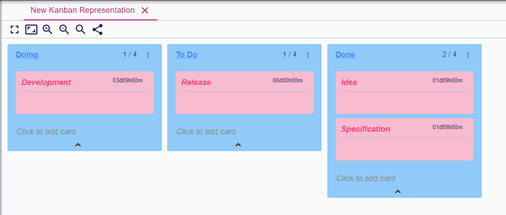
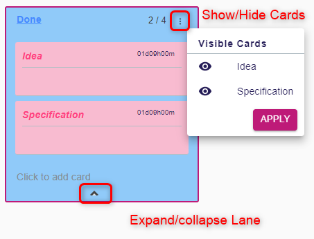

# Deck representation

A `Deck` representation is composed with many `Lanes` containing many `Cards`
Each `Lane` and `Card` is associated to a semantic element that is an object of the model represented by a `Deck` representation.

## Deck Toolbar

* `Toggle full screen mode` : It allows to display the representation in full screen
* `Fit to screen`: Adjust the zoom level to the size of the editor
* `Zoom in`
* `Zoom out`
* `Reset zoom`: Set the zoom level to default
* `Share`: Provide an URL that reaches directly the current Deck representation

## Selection

When selecting a `Lane` or a `Card`, the associated semantic element is selected in the `Explorer` and its properties are displayed in `Details`.

## Edition

To edit text area of a `Lane` or a `Card` first select and then click in the text area.
You can also press `F2` to edit the title. Then you can press `Tab` key to edit next fields.

The `Lane` editable attributes:

* `Title`

The `Card` editable attributes:

* `Title`
* `Description`
* `Label`

## Show/Hide cards

You have the ability to show/hide individual cards or hide the whole cards of a lane using the expand button.

## Moving lanes and cards

According to how the `View` model has been configured, you can update the model by *dragging and dropping* Lane or Cards.
