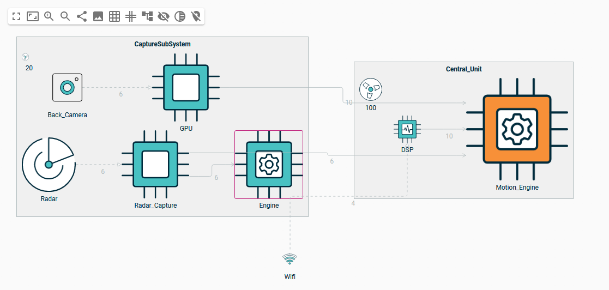
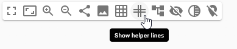
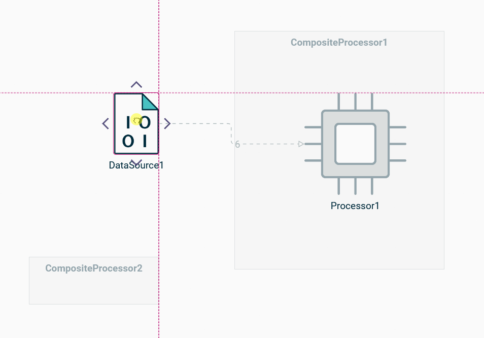
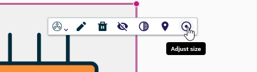
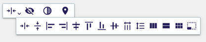

= Diagram representation

== Panel palette

=== Helper lines

Helper Lines are a visual aid that helps you align nodes in your diagram with precision.
When activated, these lines appear at the border (left, right, top, and bottom) and the center of a node.
The border helpers assist in horizontal or vertical alignment, while the center guide helps in symmetrical alignment.

Moreover, Helper Lines come with a snap feature.
When you move a node close to a helper line, it automatically snaps into place, ensuring perfect alignment without manual adjustments.
This feature makes it easy to create well-organized diagrams with minimal effort.

== Node palette

=== Adjust size tool

The _Adjust size_ tool is a handy feature that helps you optimize the size of your nodes in React Flow diagrams.
When activated, this tool automatically readjusts a node to its minimum size, removing any manual layout applied.

== Group palette

The _Group Palette_ is a contextual menu that becomes available when you select multiple elements in your diagram.
This palette provides a set of tools that allow you to perform actions on all selected elements simultaneously, making it easy to manage and modify your diagram.
You can select multiple elements either by using the _Shift + Drag_ method or by using the _Ctrl + Click_ method.

=== Distribute tools

The _Group Palette_ includes a set of tools that allow you to distribute the selected nodes in a harmonious and organized manner.
With these tools, you can quickly align and arrange multiple nodes, ensuring that your diagram is well-structured and easy to read.

NOTE: the reference node (i.e., the node that will be used as the basis for the selected operation) is the one on which the palette is opened (only available for _ctrl + click_ selection).

==== Distribute elements

* _Distribute elements horizontally_: this tool allows you to distribute the selected nodes evenly along a horizontal axis.
* _Distribute elements vertically_: this tool allows you to distribute the selected nodes evenly along a vertical axis.

==== Align

* _Align Left_: this tool aligns the selected nodes along their left borders.
* _Align Right_: this tool aligns the selected nodes along their right borders.
* _Align Center_: this tool aligns the selected nodes along their horizontal centers.
* _Align Top_: this tool aligns the selected nodes along their top borders.
* _Align Bottom_: this tool aligns the selected nodes along their bottom borders.
* _Align Middle_: this tool aligns the selected nodes along their vertical centers.

==== Justify

* _Justify horizontally_: this tool aligns the selected nodes and adjusts their width so that they are all the same size.
* _Justify vertically_: this tool aligns the selected nodes and adjusts their height so that they are all the same size.

==== Arrange

* _Arrange in row_: this tool allows you to arrange the selected nodes in a row pattern.
* _Arrange in column_: this tool allows you to arrange the selected nodes in a column pattern.
* _Arrange in grid_: this tool allows you to arrange the selected nodes in a grid pattern.

==== Other

* _Make same size_: this tool tries to apply on selected nodes the same size.
A node cannot be reduced smaller than its children require.

NOTE: Distribute tools can only be applied to elements on the same level, and cannot move pinned elements or resize non-resizable elements.
