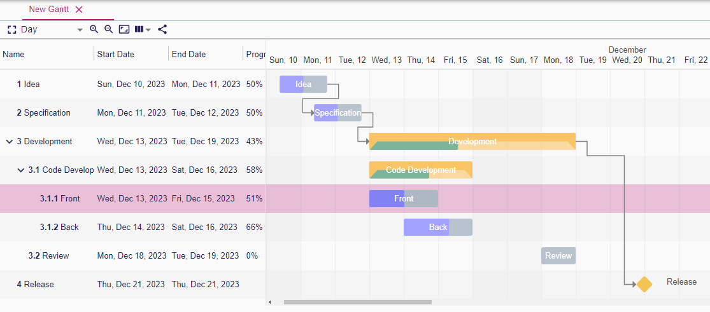
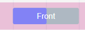
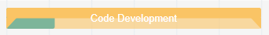
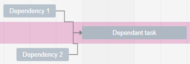
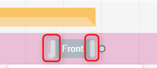
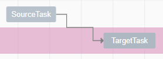
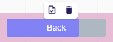
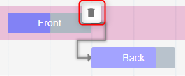
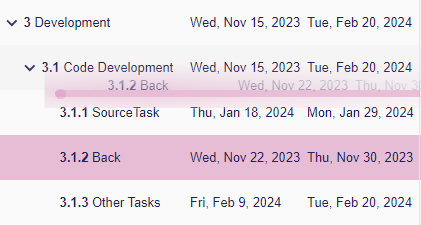

# Gantt representation

A `Gantt` representation is made of a hierarchy tasks.
Each task can contain sub-tasks.

The left part is a table.
Each row represents a task.
The columns of the table provide information about the task.

The right part is the Gantt itself.
Each row displays a task.
A task can be linked to another task with an arrow to represent a dependency relation.

## Gantt display

There are 3 types of task:

* The basic task

A color shows the progress value of the task.
Fully colored mean 100%.

* The group task that is a task which contains sub-tasks

A color shows the progress value of the task in the bottom part.
Depending on how the `TaskDescription` is configured in the `View` model, the task group may be either *computed from its sub-tasks* or defined independently as a basic task.
In the former case, the start(respectively end) date is the minimal start(respectively maximal end) date of the sub-tasks and the progress is a weighted average of the sub-tasks progress.

* The milestone represents a date. 

A task can have a list of dependencies to other tasks.
The dependencies are represented by an arrow between two tasks oriented from the dependency to the dependant task.

## Gantt Toolbar

* `Toggle full screen mode`: It allows to display the representation in full screen
* `Zoom level`: Choose the time unit in the Gantt (Hour, Half Day, Day, Two Days, Week, Month, Year)
* `Zoom in`
* `Zoom out`
* `Fit to screen`: Set the zoom level that allows to display all the tasks
* `Display columns`: Allow to hide all the columns in a click.
Using the drop down combo, the user chooses the displayed columns.
The displayed columns are persisted in the Gantt representation.
* `Share`: Provide an URL that reaches directly the current Gantt representation

## Selection

When selecting a `Task` in Gantt or in the Table, the associated semantic element is selected in the `Explorer` and its properties are displayed in `Details`.

## Edition

### Task attributes

Using handlers on the task, it is possible to change the start/end dates and the progress.
Clicking on the task and moving it left or right, allows to shift the date keeping the same duration.

When changing a date, the date is rounded accordingly to the `Date Rounding Expression` define in the `GanttDescription`.
Holiday is set as Saturday and Sunday. If the rounded date is part of the holiday, it is moved to the next or previous working date.
Note that a date rounded greater than two days is not adjusted to the working days.

### Task dependency relation

Using the round handler next the task allows to create a dependency relation.

image:images/gantt-task-dependency-tool.png[Task Dependency Tool]

### Contextual tool palettes

Clicking on a task displays a contextual menu.

* `Create Task`: It will invoke `Create Task Tool`
* `Delete Task`: It will invoke `Delete Task Tool`

Clicking on a task dependency displays a contextual menu.

* `Delete Task Dependency`: It will invoke `Create Task Dependency Tool`

### Task reordering

From the table, it is possible to drag and drop a Task to reorder the task or change its container.

* To reorder, drop the task before or after another.
* To change its container, drop the task on another task.

Note that it is not possible to drop a task in its own children hierarchy.

## Table

The table is made of rows and columns.
There is one row per task.

The first column presents the hierarchy of tasks. 
It shows the name of the task and optionally an icon to expand/collapse the sub-tasks.
The *expand status is persisted* in the Gantt representation.

The other columns display the start/end dates and the progress.

The columns can be resized and *the column width is persisted* in the Gantt representation.
From the Gantt toolbar, the columns can be hidden (See 'Gantt toolbar' section).

