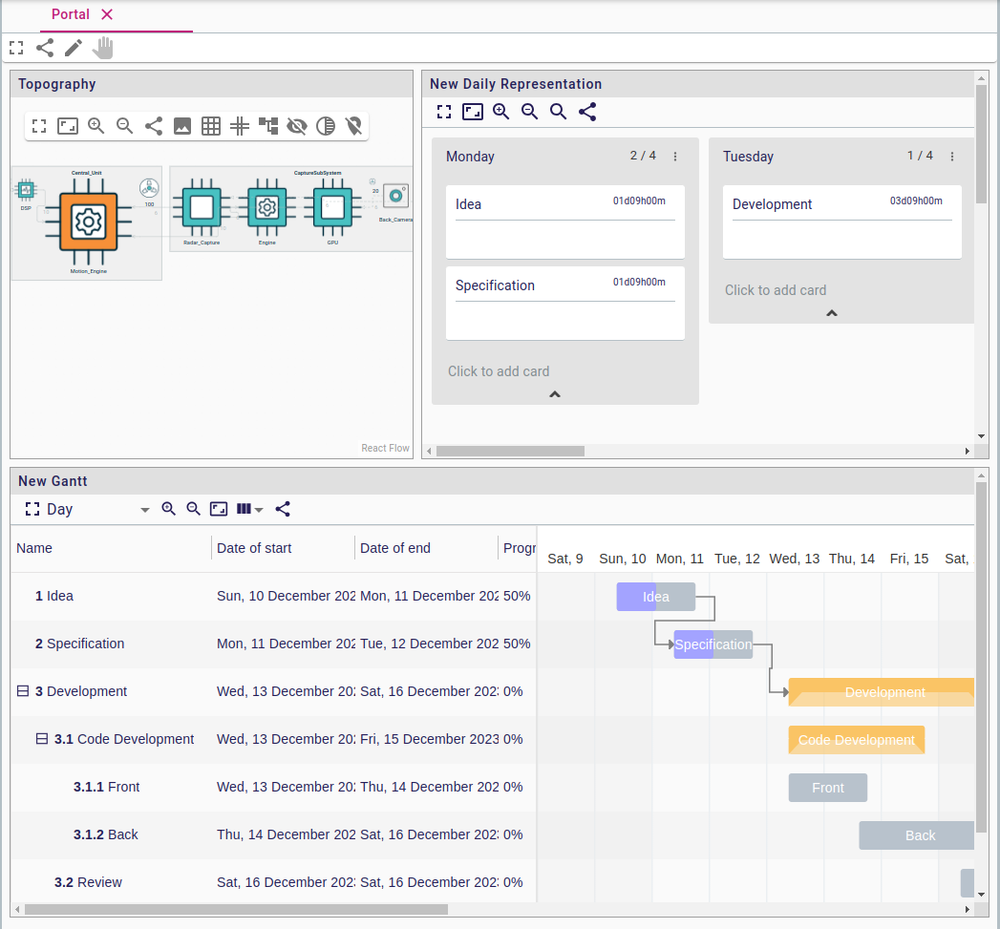
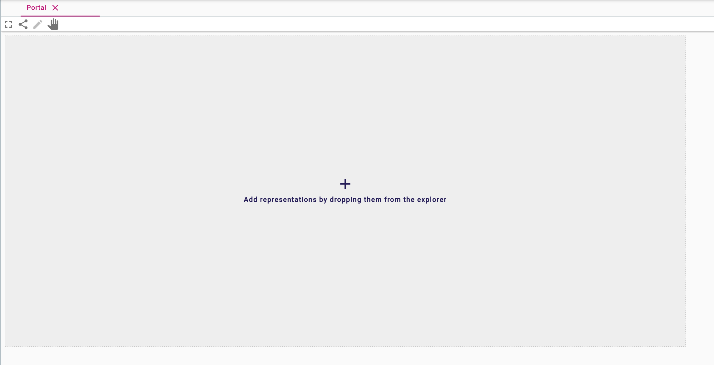
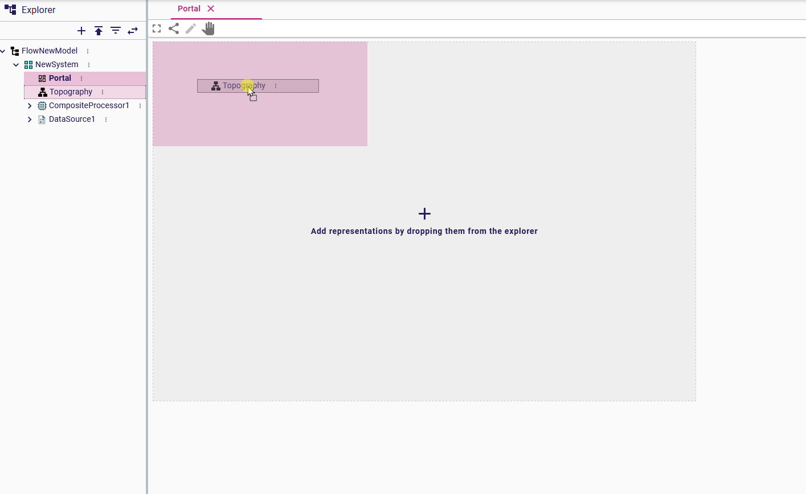
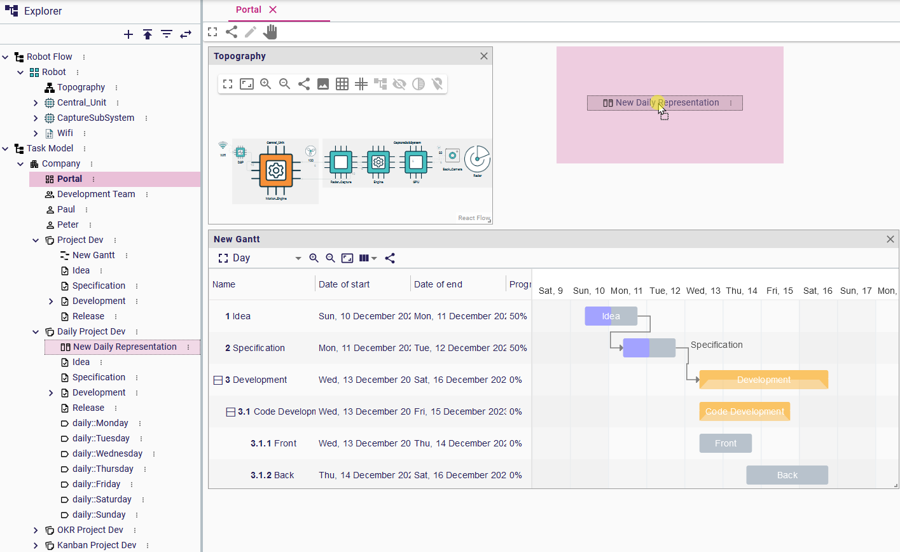
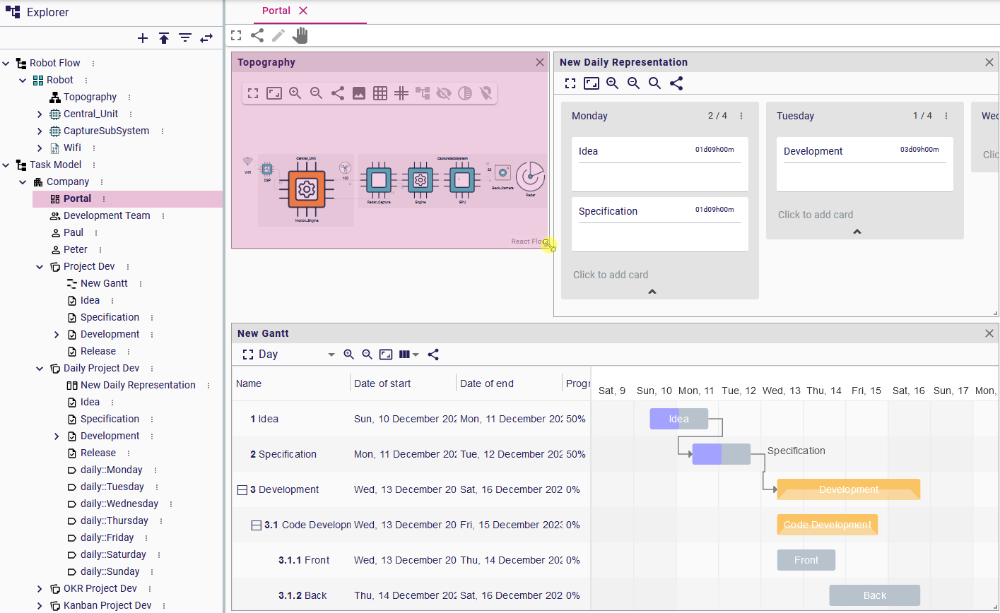
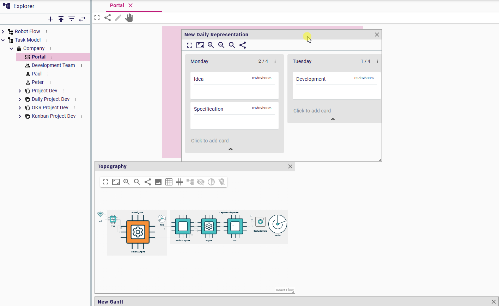
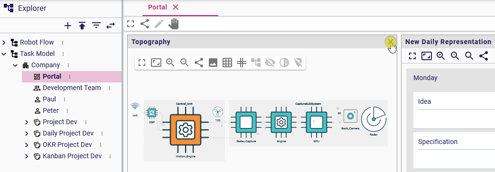
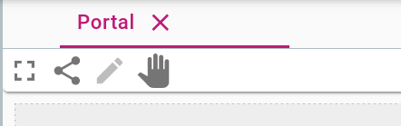

= Portal representation

Portals are dashboard-like representations that can be used to view (and edit) multiple other representations at the same time:

If the portal feature is enabled in a Sirius Web instance (which is the default), it requires no configuration and can be used by any user.
A new portal can be created on any semantic element.

To create a new portal:

. From the context menu of an element in the explorer, select _New Representation_
. Choose _Portal_ as the _Representation type_
. Give it a custom name if you want (this can always be changed later)
. Validate.

Newly created portals are empty and are initially in _portal edition_ mode (see below for details on the two possible modes) so that you can add other representations inside it.

To add a representation inside a portal:

. Make sure the portal is in _portal edition_ mode using the "Pen" icon in the portal's toolbar.
. In the _Explorer_ view, select the representation you want to add to the portal.
This can be any kind of representation, including other portals.
. Drag and drop the representation from the explorer onto the portal's canvas at the location you want it.
. After the representation has been added, you can optionally resize the frame used to display it inside the portal by dragging the bottom-right corner.

While the portal, is in _portal edition_ mode, you can repeat the process to add more representations to it.

== Portal Edition Mode _vs_ Representation Edition Mode

A portal is always in one of two possible modes:

* in _portal edition mode_, you can add, remove, mode and resize representations inside the portal, but you cannot edit the representations themselves (they are read-only).
* in _representation edition mode_, the content and layout of the portal itself is fixed, but you can interact normally with the embedded representations.

When a new portal is created (or an empty portal is opened), it is in _portal edition mode_ so that you can directly configure its content.
Otherwise, when opening an existing portal which already contains at least one representation, it is in _representation edition mode_ by default.

You can always switch manually between the two modes using the corresponding icons in the portal's toolbar:

* Click on the "Pen" icon to switch to _portal edition mode_.
* Click on the "Hand" icon to switch to the _representation edition mode_.

== Portal Edition

When in _portal edition mode_, you can configure the contents of the portal by.

To _add_ a new representation inside the portal, find it in the _Explorer_ view and then drag it from there onto the portal's canvas.
While dragging the representation, you will see feedback of where the new representation's frame will be placed, with the already existing frames moving around if needed.

To _resize_ the frame of a representation already embedded in the portal, drag its bottom-right corner:

To _move_ the frame of a representation already embedded in the portal, drag it from its header:

To _remove_ a frame from the portal, click on the _X_ icon at the right end of the header:

== Portal Toolbar

The portal's own toolbar provides the following actions:

* _Toggle full screen mode_ : It allows displaying the portal in full screen.
* _Share_: Provide an URL that reaches directly the current portal representation.
* _Edit portal configuration_: switch to portal edition mode.
* _Edit representations_: switch to representation edition mode.
