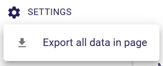

= Table representation

A `Table` representation is made of a set rows composed of multiple columns organized in a grid.
A table is associated to a semantic element, its domain type, and presents data related to this element (children elements for instance) as rows.

In the above example, the table main entry is a `Package` and each row of the table display nested elements and their sub elements of this package (`Class` for instance).

== Overview

The table representation is visually composed of several parts, starting from top to bottom there are:

* the top toolbar,
* the column headers row
* table rows
* pagination toolbar

As far as rows are concerned, each row of the table has the following structure, from left to right:

* a special column named `row header` (always the left-most column) that contains:

** the handle to resize the height of the row (grey horizontal thick line)
** chevron when hierarchical rows are handled
** the index label of the row inside the current page
** an icon
** a label

* a set of columns depending of the table representation description itself
* an action column (always the right-most column) that contains actions that could be performed on this row.

As far as the column header row is concerned, it is composed of the following parts (possibly hidden):

* an index label of the column
* the label of the column
* the handle to change the position of the column (long equal sign)
* column actions menu (three vertical dots icon)
* text field to filter table based on this column content
* the handle to resize the width of the column (grey vertical thick line)

== Toolbars and menus

=== Top main toolbar

The image below show the top tool bar of the table representation:

From left to right there are:

* Settings menu
* global filter text field
* reset rows height action
* row filters menu icon
* show/hide column filters action
* column management menu icon
* toggle full screen action

As far as the `Settings` menu is concerned, it contains two actions:

* export all data: generates a CSV file with all visible data

It worth noting that the global filter would filter rows on every textual part of the row to only keep rows that meet the text entered.
Nevertheless, it is the responsibility of the specifier to guarantee that this behavior is correctly implemented for all textual parts of the table.

The column management menu can be open by clicking on the icon representing three vertical thick lines.

This menu allows:

* to reorder columns (by dragging the equal sign)
* to pin/unpin a column on left or right of the table (using left or right pin)
* to show/hide the colum (using the switch)

On each column has its own action menu:

This menu allows:

* to clear/close the filter for this column
* to open the filter for this column
* to pin to the left of the table (first column)
* to pin to the right of the table (last column)
* to unpin if pinned
* to hide this column
* to show all columns

=== Pagination toolbar

The pagination (bottom) toolbar is located at the bottom right of the table:

The main purpose of the pagination toolbar is to set the number of row visible (per page).
Initially, the table is showing the first ten rows and if there is more than ten rows in the table the next page arrow is enabled.
User can change the number of row per page using the selector.
The predefined number are 5, 10 (default), 20 and 50.

== Selection

If the user clicks on the row header of a row, the associated semantic element is selected and other views such as Explorer or Details view are updated to show this element:

In the image above, the second row has been selected, then the class `EdgeStyle` inside the Explorer view has been selected and the Details view has been populated with the details of this element.

The selection can also be changed by clicking on one of the cells (horizontal parts of the row corresponding to column data) of the row.

== Editing data

As far as editing data is concern, user can directly change the data of a cell by clicking inside the cell.
This is only available for cells that can be editable.
Indeed, during the specification of the table, the specifier/developer chooses which cell widget he/she wants to use in his/her table.
Those cell widgets are:

* `CellLabelWidgetDescription` (read-only text)
* `CellTextfieldWidgetDescription` (single line text)
* `CellTextareaWidgetDescription` (multiple lines text)

This topic is covered in more details inside the specifier documentation of the Table representation.

== Filtering data

There are several ways to filter data in the Table representation.

=== Row filtering

These filters are designed to have a partial view of the table content.
This can be useful to focus on specific data among the whole table.
Those filters are the responsibility of the specifier who designs the table (via APi or view model) to ensure that the filter text is properly managed, _ie_ the rows that remain visible should have somewhere in their data the entered text.

==== Global filter

As described in the top toolbar section, the global filter is a text field that can be used to filter rows in a global way.
If a row is visible that means that the global filter text is present somewhere in the row content.
The global filter is applied over all columns whereas the column filter has a narrower search scope.

==== Column filters

Unlike global filter, column filters are applied only for given columns.
The main principle is that only rows that contains the entered text inside data of a specific column (where the text has entered) remain visible.
If multiple column filters are used, the table should present the set of rows that meet all these filters.

==== Row filters

Row filters are defined during the table specification.
The goal of these filters is to hide specific rows to focus on some part of the data to present.
These filters are associated to a state (activated or not), visually represented by a switch visible inside the row filters menu (see top toolbar section).

==== Sub rows

Even if this is not a filter per se, structuring the rows in a hierarchical manner can help to focus on data that matter.
That way, each row has a chevron icon that collapse (or expand) its content _ie_ sub rows.
The details of how to specify rows as a hierarchy is explained in the specifier documentation.

=== Column filtering

After presenting all the methods to filter rows, it is worth noting that each column can also be hidden.
That way, all data of the table rows for the given column are no longer visible.
As we have seen before, user can hide a specific column using the "ellipse" icon of the column header or using the general column management menu.

== Row action menu

As we have seen in the overview section, the right-most column named `Actions` contains a menu that is populated with custom actions.
Those actions should be defined during the table specification phase and they are domain specific actions for rows.
Details of how to define such row actions can be found in the specifier documentation.

The image below shows an example of such an action that remove the semantic element associated to a row, which implies that the row is deleted.

image::images/table-row-action-example.png[Table row action example, align="center"]